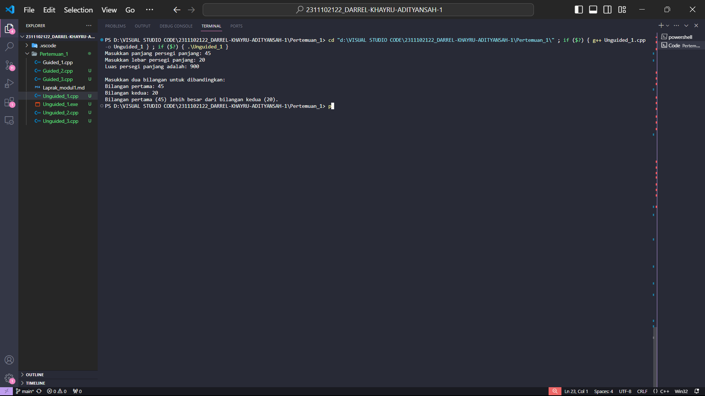

# <h1 align="center">Laporan Praktikum Modul Tipe Data</h1>

<p align="center">Darrel Khayru Adityansah</p>

## Dasar Teori

Tipe data adalah adalah sebuah pengklasifikasian data berdasarkan jenis data tersebut. Tipe data dibutuhkan agar kompiler dapat mengetahui bagaimana sebuah data akan digunakan. Tipe data yang berfungsi menempatkan variabel mana saja yang dapat diterapkan menggunakan operasi-operasi tertentu. Tipe data memungkinkan komputer untuk memahami bagaimana nilai-nilai tersebut harus diinterpretasikan dan bagaimana operasi-operasi tertentu dapat dilakukan terhadap nilai-nilai tersebut.

1. TIPE DATA PRIMITIF adalah Tipe data primitif adalah tipe data yang merupakan bawaan dalam suatu pemrograman. Tipe data ini hanya menyimpan satu nilai saja dalam satu variabelnya. Contohnya Int = bilangan bulat, Float = bilangan koma atau desimal, Bool = true or false, Char = angka, huruf, simbol dan operator logika

2. TIPE DATA ABSTRAK adalah Tipe data abstrak atau yang biasa disebut Abstrak Data Tipe(ADT) merupakan tipe data yang dibentuk oleh programer itu sendiri. Pada tipe data abstrak bisa berisi banyak tipe data, jadi nilainya bisa lebih dari satu dan beragam tipe data. Contohnya class = konsep struktur data yang lemah, struct = untuk mengelompokkan data dan fungsi

3. TIPE DATA KOLEKSI adalah tipe data yang digunakan untuk mengelola kumpulan data dengan tipe yang sama. memungkinkan Anda menyimpan, mengelola, dan mengakses sejumlah besar data dengan cara yang terstruktur.Contohnya Array = tipe data yang terdiri dari elemen-elemen yang memiliki tipe data yang sama dan diberi nama tertentu, Map = berisi pasangan key-value, vector = menyimpan dan mengelola elemen

## Guided 

### 1. [TIPE DATA PRIMITIF]

```C++
#include <iostream>
#include <iomanip>

using namespace std;

int main() {
char op;
    float num1, num2;

    cout << "Enter operator (+, -, *, /)";
cin >> op;

cout << "Enter two Operands : ";
cin >> num1 >> num2;

switch (op) {

case '+':
cout << "Result : " << num1+num2;
break;

case '-':
cout << "Result : " << num1 - num2;
break;

case '*':
cout << "Result : " << num1 * num2;
break;

case '/':
    if (num2 !=0) {
        cout << "Result : " << fixed << setprecision(2) << num1 / num2;
    } else {
        cout << " Error! Division by zero is not allowed.";
    }
    break;

    default:
        cout << "Error! Operator is not correct";
}

return 0;
}
```


### 2. [TIPE DATA ABSTRAK]

```C++
#include <stdio.h> 
#include <string.h> 
 
//Struct 
struct Mahasiswa 
{ 
    char name[50]; 
    char address[100]; 
    int age; 
}; 
int main() 
{ 
// menggunakan struct 
    struct Mahasiswa mhs1, mhs2; 
    // mengisi nilai ke struct 
    strcpy(mhs1.name, "Dian"); 
    strcpy(mhs1.address, "Mataram"); 
    mhs1.age = 22; 
    strcpy(mhs2.name, "Bambang"); 
    strcpy(mhs2.address, "Surabaya"); 
    mhs2.age = 23; 
     
    // mencetak isi struct 
    printf("## Mahasiswa 1 ##\n"); 
    printf("Nama: %s\n", mhs1.name); 
    printf("Alamat: %s\n", mhs1.address); 
    printf("Umur: %d\n", mhs1.age); 
    printf ("\n"); 
    printf("## Mahasiswa 2 ##\n"); 
    printf("Nama: %s\n", mhs2.name); 
    printf("Alamat: %s\n", mhs2.address); 
    printf("Umur: %d\n", mhs2.age); 
    return 0; 
}
```

### 3. [TIPE DATA KOLEKSI]

```C++
#include <iostream> 
#include <array> 
using namespace std; 
 
int main() { 
    // Deklarasi dan inisialisasi array 
    int nilai[5]; 
    nilai[0] = 23; 
    nilai[1] = 50; 
    nilai[2] = 34; 
    nilai[3] = 78; 
    nilai[4] = 90; 
 
    // Mencetak array dengan tab 
    cout << "Isi array pertama  : " << nilai[0] << endl; 
    cout << "Isi array kedua    : " << nilai[1] << endl; 
    cout << "Isi array ketiga   : " << nilai[2] << endl; 
    cout << "Isi array keempat  : " << nilai[3] << endl; 
    cout << "Isi array kelima   : " << nilai[4] << endl; 
 
    return 0; 
}
```
## Unguided 

### 1. [Buatlah program menggunakan tipe data primitif minimal dua fungsi dan bebas. Menampilkan program, jelaskan program tersebut dan ambil kesimpulan dari materi tipe data primitif!]

```C++
#include <iostream>
using namespace std;

// Fungsi untuk menghitung luas persegi panjang
double hitungLuasPersegiPanjang(double panjang_122, double lebar_122) {
    return panjang_122 * lebar_122;
}

// Fungsi untuk membandingkan dua bilangan dan menampilkan yang lebih besar
void bandingkanBilangan(int bil1, int bil2) {
    if (bil1 > bil2) {
        cout << "Bilangan pertama (" << bil1 << ") lebih besar dari bilangan kedua (" << bil2 << ")." << endl;
    } else if (bil2 > bil1) {
        cout << "Bilangan kedua (" << bil2 << ") lebih besar dari bilangan pertama (" << bil1 << ")." << endl;
    } else {
        cout << "Kedua bilangan (" << bil1 << ") dan (" << bil2 << ") sama besar." << endl;
    }
}

int main() {
    double panjang_122, lebar_122;
    int bil1, bil2;

    // Input panjang dan lebar persegi panjang
    cout << "Masukkan panjang persegi panjang: ";
    cin >> panjang_122;
    cout << "Masukkan lebar persegi panjang: ";
    cin >> lebar_122;

    // Hitung dan tampilkan luas persegi panjang
    double luas_122 = hitungLuasPersegiPanjang(panjang_122, lebar_122);
    cout << "Luas persegi panjang adalah: " << luas_122 << endl;
    // Input dua bilangan untuk dibandingkan
    cout << "\nMasukkan dua bilangan untuk dibandingkan:" << endl;
    cout << "Bilangan pertama: ";
    cin >> bil1;
    cout << "Bilangan kedua: ";
    cin >> bil2;

    // Membandingkan dua bilangan dan menampilkan hasilnya
    bandingkanBilangan(bil1, bil2);

    return 0;
}

```
### output:

=> penjelasan Program 
kode diatas merupakan program sederhana dari bahasa pemrograman C++. Program ini meminta pengguna untuk memasukkan panjang dan lebar persegi panjang, lalu menghitung dan menampilkan luasnya. Selain itu, program juga meminta pengguna untuk memasukkan dua bilangan dan membandingkannya, menampilkan pesan tentang bilangan yang lebih besar atau jika keduanya sama besar. Program ini menggunakan fungsi-fungsi untuk melakukan perhitungan dan pembandingan, serta menggunakan input-output standar untuk berinteraksi dengan pengguna melalui terminal.

=> Kesimpulan dari tipe data primitif
Tipe data primitif adalah dasar dari bahasa pemrograman seperti C++. Mereka adalah jenis nilai dasar seperti bilangan bulat, pecahan, karakter, dan nilai boolean. Memahami tipe data primitif penting karena mereka membentuk fondasi dari struktur data dan operasi yang lebih kompleks dalam program. Selain itu, pemilihan tipe data yang tepat dapat mempengaruhi penggunaan memori dan kinerja program secara keseluruhan.

### 2. [Jelaskan fungsi dari class dan struct secara detail dan berikan contoh programnya ]

```C++
#include <iostream>
#include <string>
using namespace std;

// Class untuk merepresentasikan mobil
class Mobil {
private:
    string merek;
    string model;
    int tahun;
    bool tersedia;

public:
    // Constructor untuk inisialisasi mobil
    Mobil(string jenismerek, string jenismodel, int jenistahun) {
        merek = jenismerek;
        model = jenismodel;
        tahun = jenistahun;
        tersedia = true; // Saat mobil pertama kali dibuat, diasumsikan tersedia
    }

    // Function untuk menampilkan informasi mobil
    void tampilkanInfo() {
        cout << "Mobil: " << merek << " " << model << " (" << tahun << ")" << endl;
        cout << "Status: " << (tersedia ? "Tersedia" : "Tidak Tersedia") << endl;
    }

    // Function untuk menyewa mobil
    void sewaMobil() {
        if (tersedia) {
            tersedia = false;
            cout << "Mobil berhasil disewa." << endl;
        } else {
            cout << "Maaf, mobil tidak tersedia untuk disewa saat ini." << endl;
        }
    }

    // Function untuk mengembalikan mobil
    void kembalikanMobil() {
        if (!tersedia) {
            tersedia = true;
            cout << "Mobil berhasil dikembalikan." << endl;
        } else {
            cout << "Mobil sudah tersedia." << endl;
        }
    }
};

int main() {
    // Membuat objek mobil
    Mobil mobil1_122("Toyota", "innova", 2013);
    Mobil mobil2_122("Toyota", "hilux", 2017);

    // Menampilkan informasi mobil sebelum disewa
    cout << "Informasi mobil sebelum disewa:" << endl;
    mobil1_122.tampilkanInfo();
    mobil2_122.tampilkanInfo();

    // Menyewa mobil
    mobil1_122.sewaMobil();
    mobil2_122.sewaMobil();

    // Menampilkan informasi mobil setelah disewa
    cout << "\nInformasi mobil setelah disewa:" << endl;
    mobil1_122.tampilkanInfo();
    mobil2_122.tampilkanInfo();

    // Mengembalikan mobil
    mobil1_122.kembalikanMobil();
    mobil2_122.kembalikanMobil();

    // Menampilkan informasi mobil setelah dikembalikan
    cout << "\nInformasi mobil setelah dikembalikan:" << endl;
    mobil1_122.tampilkanInfo();
    mobil2_122.tampilkanInfo();

    return 0;
}
```

### output :


=> Penjelasan Program
Program ini merupakan contoh sederhana dari penggunaan class dalam C++, yang merepresentasikan objek mobil. Setiap mobil memiliki atribut seperti merek, model, tahun, dan status ketersediaan. Program ini memiliki beberapa fungsi anggota, seperti `tampilkanInfo()` untuk menampilkan informasi mobil, `sewaMobil()` untuk menyewa mobil, dan `kembalikanMobil()` untuk mengembalikan mobil. Program utama membuat dua objek mobil, menampilkan informasi mereka, menyewa salah satu mobil, mengembalikan mobil tersebut, dan kemudian menampilkan informasi mobil kembali setelah penyewaan dan pengembalian. Ini adalah contoh penggunaan class untuk mengorganisir data dan fungsionalitas terkait bersama dalam sebuah program.

### 3. [Buat dan jelaskan program menggunakan fungsi map dan jelaskan perbedaan dari array dengan map.]

```C++
#include <iostream>
#include <map>
#include <unordered_map>

using namespace std;

int main()
{
    // array untuk menyimpan data index dan nama
    cout << "LIST DATA MAP" << endl;
    string nama_122[5] = {"DARREL", "AHMAD", "TOM", "JERI", "BAGAS"};

    // menampilkan isi array satu per satu sesuai index
    cout << "1 : " << nama_122[0] << endl;
    cout << "2 : " << nama_122[1] << endl;
    cout << "3 : " << nama_122[2] << endl;
    cout << "4 : " << nama_122[3] << endl;
    cout << "5 : " << nama_122[4] << endl;

    // menggunakan map untuk menyimpan data index dan nama dalam satu variabel
    cout << "\n";
    cout << "menampilkan  data map" << endl;
    map<int, string> makanan;
    makanan[1] = "Magelangan";
    makanan[2] = "Gado-gado";
    makanan[3] = "Ketoprak";
    makanan[4] = "Gulai";
    makanan[5] = "jengkol";
    // menampilkan isi dari data map
    cout << "makanan[1] :" << makanan[1] << endl;
    cout << "makanan[2] :" << makanan[2] << endl;
    cout << "makanan[3] :" << makanan[3] << endl;
    cout << "makanan[4] :" << makanan[4] << endl;
    cout << "makanan[5] :" << makanan[5] << endl;
    return 0;
}
```
#### Output:


=> Penjelasan Program
kode di atas merupakan penggunaan array dan map. Pertama kita mempunyai sebuah array yang berisi lima nama orang dengan indeks nama_122. Dengan array ini, kita dapat mencetak nama-nama tersebut dengan memanggil indeksnya satu per satu. Selanjutnya, kita menggunakan map untuk menyimpan data tentang nama makanan. Setiap data disimpan dalam pasangan key-value, di mana keynya adalah nomor indeks dan valuenya adalah nama makanan. Setelah data tersimpan dalam map, kita dapat mencetak nama makanan dengan memanggil nilai dari map menggunakan key yang telah ditetapkan sebelumnya. Ini adalah contoh penggunaan array dan map dalam C++ untuk menyimpan dan mengakses data dengan cara yang berbeda.

=>perbedaan array dan map
layaknya seperti array, map menyimpan data dalam pasangan key-value, di mana setiap elemen memiliki key yang unik dan nilai yang sesuai, ukuran dinamis yang dapat berubah seiring waktu dan dapat diakses dengan key yang berupa tipe data apa pun. sementara Array menyimpan data secara berurutan dalam memori dengan indeks numerik, sehingga elemen-elemennya diakses menggunakan indeks tersebut dan memiliki ukuran tetap yang ditentukan saat deklarasi dan hanya dapat diakses melalui indeks numerik.

## Kesimpulan
Tipe data dalam pemrograman dibagi menjadi tiga jenis. Pertama, tipe data primitif contohnya int, float, char, dan boolean. Kedua, tipe data abstrak (ADT) yang dibentuk oleh programmer, contohnya kelas dalam OOP. Terakhir, tipe data koleksi seperti array, vector, dan map yang digunakan untuk mengelompokkan dan menyimpan data secara bersamaan. 

## Referensi
[1] I. Holm, Narrator, and J. Fullerton-Smith, Producer, How to Build a Human [DVD]. London: BBC; 2002.
[2] Tipe Data. (2024). Diakses pada 12 maret 2024. https://revou.co/kosakata/tipe-data
[3] Macam-Macam Tipe Data Pemrograman Beserta Fungsinya. (2020). Diakses pada 12 maret 2024. https://www.dicoding.com/blog/macam-macam-tipe-data/