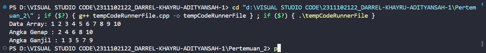
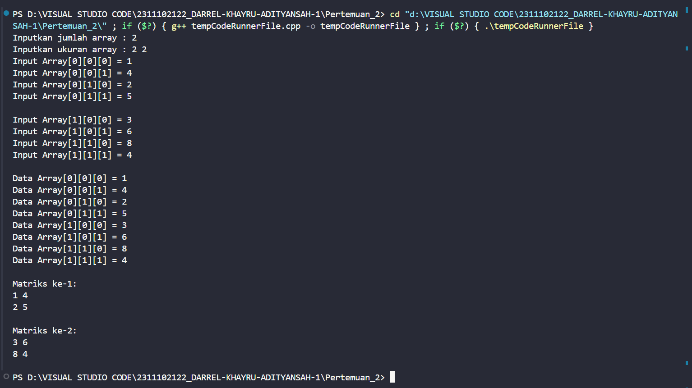
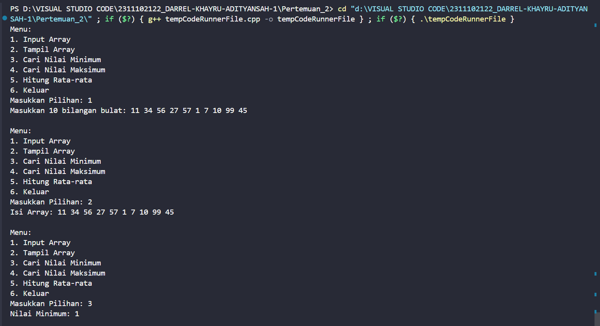
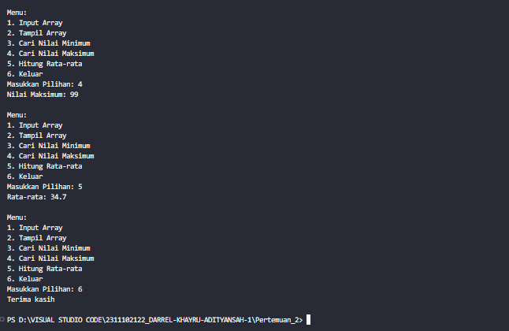

# <h1 align="center">Laporan Praktikum Modul Array</h1>

<p align="center">Darrel Khayru Adityansah</p>

## Dasar Teori

Array adalah struktur data yang menyimpan data-data bertipe sama dalam urutan tertentu. Array dapat di analogikan sebagai sebuah loker yang memiliki sederetan kotak penyimpanan yang diberi nomor berurutan.Data-data dalam array disebutelemen array. Dengan array setiap elemen bisa diakses langsung melalui indeksnya, berlebihan lain dari array adalah kita bisa memakai sejumlah variable dengan nama yang sama asalkan variable tersebut dalam indeks yang berbeda. Dilihat dari dimensinya array dapat dibagi menjadi Array dimensi satu, array dimensi dua dan array multi-dimensi.

ARRAY BERDIMENSI SATU
Array berdimensi satu adalah tipe variabel yang terdiri dari kumpulan data dengan tipe yang sama yang disusun dalam satu baris atau satu dimensi. Setiap elemen array dapat diakses melalui indeks. Indeks array (subscript) secara default dimulai dari 0. 

ARRAY DIMENSI DUA 
Array dua dimensi adalah variable yang terdiri dari kumpulan array satu dimensi dengan tipe yang sama yang disusun dalam baris dan kolom. Array dua dimensi merupakan array yang terdiri dari m buah baris dan n buah kolom. Bentuknya dapat berupa matriks atau tabel. Digunakan untuk berbagai keperluan, misalnya dalam bentuk tabel, matrik dan sebagainya  

ARRAY MULTI DIMENSI
Array multi-dimensi merupakan array yang mempunyai ukuran lebih dari dua. Bentuk pendeklarasian array sama saja dengan array dimensi satu maupun array dimensi dua, seperti array tiga dimensi, array empat dimensi, array lima dimensi, dan seterusnya.  

Kelebihan Array:  
•	Merupakan struktur penyimpanan data yang paling mudah. 
•	Tipe data yang mampu menampung lebih dari satu data. 
•	Memori ekonomis, bisa semua elemen terisi. 
•	Waktu akses sama setiap elemen. 
•	Dapat diakses secara random.  
 
Kekurangan array:  
•	Boros memori jika banyak elemen yang tidak digunakan.  
•	Merupakan struktur penyimpanan data yang statis.  
•	Kebanyakan bahasa pemrograman mengimplementasikan array statis yang sulit diubah ukurannya pada saat eksekusi


## Guided 

### 1. [lProgram Input Array Tiga Dimensi]

```C++
#include <iostream>
using namespace std;
// PROGRAM INPUT ARRAY 3 DIMENSI

int main()
{
    // Deklarasi array
    int arr[2][3][3];
    // Input elemen
    for (int x = 0; x < 2; x++)
    {
        for (int y = 0; y < 3; y++)
        {
            for (int z = 0; z < 3; z++)
            {
            cout << "Input Array[" << x << "][" << y << "][" << z << "] = ";
            cin >> arr[x][y][z];
        }
    }
    cout << endl;
}

// Output Array
for (int x = 0; x < 2; x++)
{
    for (int y = 0; y < 3; y++)
    {
        for (int z = 0; z < 3; z++)
        {
        cout << "Data Array[" << x << "][" << y << "][" << z << "] = " << arr[x][y][z] << endl;
        }
    }
}
cout << endl;
// Tampilan array
for (int x = 0; x < 2; x++)
{
    for (int y = 0; y < 3; y++)
    {
        for (int z = 0; z < 3; z++)
        {
        cout << arr[x][y][z] << ends;
    }
    cout << endl;
    }
    cout << endl;
    }
}
```
=> penjelasan Program 
program array tiga dimensi untuk menyimpan data dalam struktur berlapis. Pertama kali program mendeklarasikan sebuah array dengan ukuran 2x3x3. lalu pengguna diminta untuk memasukkan nilai untuk setiap elemen array. Setelah memasukkan nilai, program mencetak nilai setiap elemen yang dimasukkan. Selain itu, program juga mencetak nilai dari setiap elemen array. Akhirnya, program menampilkan tampilan array dengan mencetak setiap elemen secara berurutan.

### 2. [Program Mencari Nilai Maksimal pada Array]

```C++
#include <iostream> 
using namespace std; 

int main() {
    int maks, a, i = 1, lokasi; 
    cout << "Masukkan panjang array: "; 
    cin >> a; 
    int array[a]; 
    cout << "Masukkan " << a << " angka\n"; 
    for (i = 0; i < a; i++) {
        cout << "Array ke-" << (i) << ": "; 
        cin >> array[i];
    } 
    maks = array[0]; 
    for (i = 0; i < a; i++) {
        if (array[i] > maks) {
            maks = array[i]; 
            lokasi = i;
        }
    } 
    cout << "Nilai maksimum adalah " << maks << " berada di Array ke " << lokasi << endl;

    return 0;
}

```
=> penjelasan Program 
mencari nilai maksimum dalam sebuah array yang diisi oleh pengguna. program meminta pengguna untuk memasukkan panjang array, kemudian menguraikan array tersebut. Pengguna memasukkan angka panjang array yang telah ditentukan. Setelah array terisi, program mencari nilai maksimum dalam array menggunakan loop, dan menyimpan nilai maksimum beserta lokasinya. lalu program mencetak nilai maksimum beserta lokasinya dalam array.


## Unguided 

### 1. [Buatlah program untuk menampilkan Output seperti berikut dengan data yang diinputkan oleh user]

```C++
#include <iostream>
using namespace std;

int main() {
    
    int angka_122[10] = {1, 2, 3, 4, 5, 6, 7, 8, 9, 10};
    
    cout << "Data Array: ";
    for (int i = 0; i < 10; i++) {
        cout << angka_122[i] << " ";
    }
    cout << endl;

    cout << "Angka Genap : ";
    for (int i = 0; i < 10; i++) {
        if (angka_122[i] % 2 == 0) {
            cout << angka_122[i] << " ";
        }
    }
    cout << endl;

    cout << "Angka Ganjil : ";
    for (int i = 0; i < 10; i++) {
        if (angka_122[i] % 2 != 0) {
            cout << angka_122[i] << " ";
        }
    }
    cout << endl;

    return 0;
}
```
### output:

=> penjelasan Program 
Program menampilkan sebuah array angka dari 1 hingga 10. Setelah mencetak seluruh angka dalam array, program memisahkan angka-angka tersebut menjadi dua kelompok. angka genap dan angka ganjil, Angka genap dicetak terlebih dahulu, diikuti oleh angka ganjil. Hal ini dilakukan dengan menggunakan loop untuk mengecek setiap angka dalam array, dan jika angka tersebut habis dibagi dua (hasil bagi adalah 0), maka angka tersebut dianggap genap. Sebaliknya, jika angka tersebut tidak habis dibagi dua, maka angka tersebut dianggap ganjil.

### 2. [Buatlah program Input array tiga dimensi (seperti pada guided) tetapi jumlah atau ukuran elemennya diinputkan oleh user ]

```C++
#include <iostream> 
using namespace std; 

int main() { 
    int a, b, c; 
    cout <<"Inputkan jumlah array : "; 
    cin >> a; 
    cout << "Inputkan ukuran array : "; 
    cin >> b >> c; 
    
    int arr_122[a][b][c]; 
    //Input elemen 
    for (int i = 0; i < a; i++) { 
        for (int j = 0; j < b; j++) { 
            for (int k = 0; k < c; k++) { 
                cout << "Input Array[" << i << "][" << j << "][" << k << "] = "; 
                cin >> arr_122[i][j][k]; 
            } 
        } 
        cout << endl; 
    } 
    //Output Array 
    for (int i = 0; i < a; i++) { 
        for (int j = 0; j < b; j++) { 
            for (int k = 0; k < c; k++) { 
                cout << "Data Array[" << i << "][" << j << "][" << k << "] = " << arr_122[i][j][k] << endl; 
            }
            
        } 
    }
    cout << endl; 
    //Tampilan array 
    for (int i = 0; i < a; i++) { 
        cout << "Matriks ke-" << i+1 << ":" << endl; 
        for (int j = 0; j < b; j++) { 
            for (int k = 0; k < c; k++) { 
                cout << arr_122[i][j][k] << " "; 
            } 
             cout << endl; 
        } 
        cout << endl; 
    } 
    return 0; 
}
```

### output :

=> Penjelasan Program
Program array multidimensi dengan ukuran yang ditentukan. Pengguna diminta untuk memasukkan jumlah, baris, dan kolom dari array yang ingin dibuat. Setelah itu, program meminta pengguna untuk memasukkan nilai untuk setiap elemen array. Nilai-nilai ini dicetak sesuai dengan indeksnya lalu program menampilkan tampilan matriks dari setiap array yang telah dibuat dengan memisahkan setiap baris dan kolom.

### 3. [Buatlah program menu untuk mencari nilai Maksimum, Minimum dan Nilai rata – rata dari suatu array dengan input yang dimasukan oleh user!]

```C++
#include <iostream>
using namespace std;

int main() {
    int pilih_122;
    int bil[10];
    bool tersimpan = false;

    while (true) {
        cout << "Menu: " << endl;
        cout << "1. Input Array" << endl;
        cout << "2. Tampil Array" << endl;
        cout << "3. Cari Nilai Minimum" << endl;
        cout << "4. Cari Nilai Maksimum" << endl;
        cout << "5. Hitung Rata-rata" << endl;
        cout << "6. Keluar" << endl;
        cout << "Masukkan Pilihan: ";
        cin >> pilih_122;

        switch (pilih_122) {
            case 1:
                cout << "Masukkan 10 bilangan bulat: ";
                for (int i = 0; i < 10; i++) {
                    cin >> bil[i];
                }
                tersimpan = true;
                cout<<endl;
                break;
                cout<<endl;
            case 2:
                if (tersimpan) {
                    cout << "Isi Array: ";
                    for (int i = 0; i < 10; i++) {
                        cout << bil[i] << " ";
                    }
                    cout << endl;
                } else {
                    cout << "Array belum diisi." << endl;
                }
                cout<<endl;
                break;

            case 3:
                if (tersimpan) {
                    int minVal = bil[0];
                    for (int i = 1; i < 10; i++) {
                        if (bil[i] < minVal) {
                            minVal = bil[i];
                        }
                    }
                    cout << "Nilai Minimum: " << minVal << endl;
                } else {
                    cout << "Array belum diisi." << endl;
                }
                cout<<endl;
                break;
            case 4:
                if (tersimpan) {
                    int maxVal = bil[0];
                    for (int i = 1; i < 10; i++) {
                        if (bil[i] > maxVal) {
                            maxVal = bil[i];
                        }
                    }
                    cout << "Nilai Maksimum: " << maxVal << endl;
                } else {
                    cout << "Array belum diisi." << endl;
                }
                cout<<endl;
                break;

            case 5:
                if (tersimpan) {
                    int sum = 0;
                    for (int i = 0; i < 10; i++) {
                        sum += bil[i];
                    }
                    double average = static_cast<double>(sum) / 10;
                    cout << "Rata-rata: " << average << endl;
                } else {
                    cout << "Array belum diisi." << endl;
                }
                cout<<endl;
                break;

            case 6:
                cout << "Terima kasih" << endl;
                cout<<endl;
                return 0;
            default:
                cout << "Pilihan tidak valid" << endl;

        }
    }

    return 0;
}
```
#### Output:


=> Penjelasan Program
Program menu untuk melakukan berbagai operasi pada array bilangan bulat. Program menyediakan beberapa opsi menu, di antaranya adalah menginputkan array, menampilkan array, mencari nilai minimum dan maksimum, menghitung rata-rata, dan keluar dari program. Pengguna dapat memilih opsi yang diinginkan dengan memasukkan nomor yang sesuai. Setiap opsi menu diimplementasikan melalui switch case. Program akan terus berjalan hingga pengguna memilih untuk keluar.


## Kesimpulan
Array adalah struktur data yang dapat menyimpan sekumpulan elemen data bertipe sama dalam urutan tertentu. Mirip dengan loker dengan nomor unik, setiap elemen dalam array dapat diakses berdasarkan indeks. Array dapat memiliki berbagai macam dimensi,  dari satu dimensi (satu baris data) hingga multidimensi (matriks atau tabel data). Keuntungan array mencakup kemudahan menyimpan dan mengakses data, serta  waktu akses yang konsisten berapa pun jumlah elemennya. 


## Referensi
[1] APA ITU ARRAY. (2022). Diakses pada tanggal 19 maret 2024. https://algorit.ma/blog/array-adalah-2022/ 
[2] AdzrielArraffi, TIPE DATA LARIK (ARRAY), 2019
[3] Meidyan Permata Putri, Guntoro Barovih, Rezania Agramanisti Azdy, Yuniansyah, Andri Saputra, Yesi Sriyeni, Arsia Rini, Fadhila Tangguh Admojo. ALGORITMA DAN STRUKTUR DATA, 2022, pp 89-106

