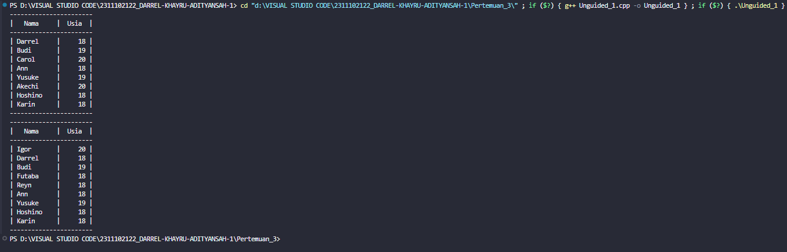
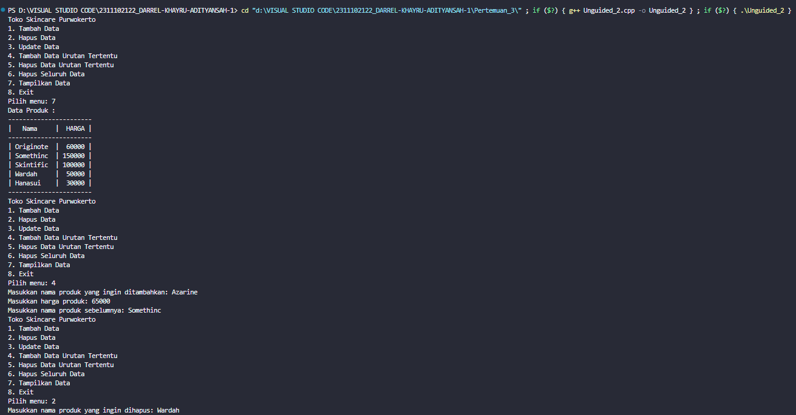

# <h1 align="center">Laporan Praktikum Modul Linked List</h1>

<p align="center">Darrel Khayru Adityansah</p>

## Dasar Teori
Linked list adalah suatu bentuk struktur data yang berupa sekumpulan elemen data yang bertipe sama dimana  tiap elemen saling berkaita atau dihubungkan dengan elemen lain melalui suatu pointer. Linked list  terdiri dari node-node (simpul-simpul) yang saling terhubung (linked). Simpul berupa struct, sedangkan link berupa komponen yang bertipe pointer ke simpul. Jenis linked list yang dapat di proses : singly linked list, doubly linked list, Singly circular linked list, doubly circular linked list tetapi dalam praktikum kali ini hanya membahas linked list single dan double.

SINGLE LINKED LIST
struktur data di mana setiap simpul memiliki dua bagian: data dan referensi ke simpul berikutnya. tiap node nya memiliki field yang berisi pointer ke node berikutnya dan juga memiliki field yang berisi data. Akhir linked list ditandai dengan node terakhir yang menunjuk ke null yang akan digunakan sebagai kondisi berhenti saat pembacaan linked list.

DOUBLE LINKED LIST
memiliki tiga bagian dalam setiap simpul: data, referensi ke simpul sebelumnya, dan referensi ke simpul berikutnya. Dengan menggunakan pointer, dimana setiap node memiliki tiga buah field, yaitu : field pointer yang menunjuk ke pointer berikutnya, field pointer yang menunjuk ke pointer sebelumnya dan field yang berisi data dari node tersebut.  Semenatara pointer next dan prev-nya menunjuk ke null.

## Guided 

### 1. [Single Linked List]

```C++
#include <iostream>
using namespace std;

struct Node
{
    int data;
    Node *next;
};
Node *head;
Node *tail;

void init()
{
    head = NULL;
    tail = NULL;
}

bool isEmpty()
{
    if (head == NULL)
        return true;
    else
        return false;
}

void insertDepan(int nilai)
{
   
    Node *baru = new Node;
    baru->data = nilai;
    baru->next = NULL;
    if (isEmpty() == true)
    {
        head = tail = baru;
        tail->next = NULL;
    }
    else
    {
        baru->next = head;
        head = baru;
    }
}

void insertBelakang(int nilai)
{
   
    Node *baru = new Node;
    baru->data = nilai;
    baru->next = NULL;
    if (isEmpty() == true)
    {
        head = tail = baru;
        tail->next = NULL;
    }
    else
    {
        tail->next = baru;
        tail = baru;
    }
}

int hitungList()
{
    Node *hitung;
    hitung = head;
    int jumlah = 0;
    while (hitung != NULL)
    {
        jumlah++;
        hitung = hitung->next;
    }
    return jumlah;
}

void insertTengah(int data, int posisi)
{
    if (posisi < 1 || posisi > hitungList())
    {
        cout << "Posisi diluar jangkauan" << endl;
    }
    else if (posisi == 1)
    {
        cout << "Posisi bukan posisi tengah" << endl;
    }
    else
    {
        Node *baru, *bantu;
        baru = new Node();
        baru->data = data;
        
        bantu = head;
        int nomor = 1;
        while (nomor < posisi - 1)
        {
            bantu = bantu->next;
            nomor++;
        }
        baru->next = bantu->next;
        bantu->next = baru;
    }
}

void hapusDepan()
{
    Node *hapus;
    if (isEmpty() == false)
    {
        if (head->next != NULL)
        {
            hapus = head;
            head = head->next;
            delete hapus;
        }
        else
        {
            head = tail = NULL;
        }
    }
    else
    {
        cout << "List kosong!" << endl;
    }
}

void hapusBelakang()
{
    Node *hapus;
    Node *bantu;
    if (isEmpty() == false)
    {
        if (head != tail)
        {
            hapus = tail;
            bantu = head;
            while (bantu->next != tail)
            {
                bantu = bantu->next;
            }
            tail = bantu;
            tail->next = NULL;
            delete hapus;
        }
        else
        {
            head = tail = NULL;
        }
    }
    else
    {
        cout << "List kosong!" << endl;
    }
}

void hapusTengah(int posisi)
{
    Node *hapus, *bantu, *bantu2;
    if (posisi < 1 || posisi > hitungList())
    {
        cout << "Posisi di luar jangkauan" << endl;
    }
    else if (posisi == 1)
    {
        cout << "Posisi bukan posisi tengah" << endl;
    }
    else
    {
        int nomor = 1;
        bantu = head;
        while (nomor <= posisi)
        {
            if (nomor == posisi - 1)
            {
                bantu2 = bantu;
            }
            if (nomor == posisi)
            {
                hapus = bantu;
            }
            bantu = bantu->next;
            nomor++;
        }
        bantu2->next = bantu;
        delete hapus;
    }
}

void ubahDepan(int data)
{
    if (isEmpty() == false)
    {
        head->data = data;
    }
    else
    {
        cout << "List masih kosong!" << endl;
    }
}

void ubahTengah(int data, int posisi)
{
    Node *bantu;
    if (isEmpty() == false)
    {
        if (posisi < 1 || posisi > hitungList())
        {
            cout << "Posisi di luar jangkauan" << endl;
        }
        else if (posisi == 1)
        {
            cout << "Posisi bukan posisi tengah" << endl;
        }
        else
        {
            bantu = head;
            int nomor = 1;
            while (nomor < posisi)
            {
                bantu = bantu->next;
                nomor++;
            }
            bantu->data = data;
        }
    }
    else
    {
        cout << "List masih kosong!" << endl;
    }
}

void ubahBelakang(int data)
{
    if (isEmpty() == false)
    {
        tail->data = data;
    }
    else
    {
        cout << "List masih kosong!" << endl;
    }
}

void clearList()
{
    Node *bantu, *hapus;
    bantu = head;
    while (bantu != NULL)
    {
        hapus = bantu;
        bantu = bantu->next;
        delete hapus;
    }
    head = tail = NULL;
    cout << "List berhasil terhapus!" << endl;
}

void tampil()
{
    Node *bantu;
    bantu = head;
    if (isEmpty() == false)
    {
        while (bantu != NULL)
        {
            cout << bantu->data << ends;
            bantu = bantu->next;
        }
        cout << endl;
    }
    else
    {
        cout << "List masih kosong!" << endl;
    }
}
int main()
{
    init();
    insertDepan(3);
    tampil();
    insertBelakang(5);
    tampil();
    insertDepan(2);
    tampil();
    insertDepan(1);
    tampil();
    hapusDepan();
    tampil();
    hapusBelakang();
    tampil();
    insertTengah(7, 2);
    tampil();
    hapusTengah(2);
    tampil();
    ubahDepan(1);
    tampil();
    ubahBelakang(8);
    tampil();
    ubahTengah(11, 2);
    tampil();
    return 0;
}
```
=> penjelasan Program
Program memungkinkan penggunaan operasi dasar seperti penambahan, penghapusan, dan pengubahan elemen dalam daftar. Fungsi-fungsi yang telah didefinisikan memiliki peran yang jelas dalam memanipulasi linked list. Mulai dari penambahan elemen baik di bagian depan, belakang, maupun tengah, hingga penghapusan elemen di posisi tertentu atau di ujung linked list. Terdapat pula fungsi-fungsi tambahan seperti untuk memeriksa apakah linked list kosong, menghitung jumlah elemen, menghapus seluruh isi linked list, serta menampilkan isi dari linked list. Fungsi main bertindak sebagai pengujian terhadap operasi-operasi yang telah didefinisikan, dan menampilkan hasil dari setiap operasi yang dilakukan pada linked list. Dengan demikian, program ini menyediakan berbagai fungsi yang berguna untuk manipulasi data dalam struktur data linked list.


### 2. [Double LInked List]

```C++
#include <iostream> 
using namespace std;
class Node {   
    public:int data;
  Node* prev;
  Node* next;
}; class DoublyLinkedList {     
    public:     
    Node* head;
    Node* tail;
    DoublyLinkedList() {       
        head = nullptr;       
        tail = nullptr;
  }
  void push(int data) {     
    Node* newNode = new Node;     
    newNode->data = data;     
    newNode->prev = nullptr;     
    newNode->next = head;     
    if (head != nullptr) {
      head->prev = newNode;
    }     else {
      tail = newNode;
    }
    head = newNode;
  }
  void pop() {     
    if (head == nullptr) {       
        return;
    }
    Node* temp = head;     
    head = head->next;     
    if (head != nullptr) {
      head->prev = nullptr;
    }     else {
      tail = nullptr;
    }
    delete temp;
  }
  bool update(int oldData, int newData) {
    Node* current = head;
    while (current != nullptr) {      
        if (current->data == oldData) {         
            current->data = newData;
        return true;
      }
      current = current->next;
    }
    return false;
  }
  void deleteAll() {

    Node* current = head;     
    while (current != nullptr) {       
        Node* temp = current;       
        current = current->next;
      delete temp;
    }
    head = nullptr;     
    tail = nullptr;
  }
  void display() {     
    Node* current = head;     
    while (current != nullptr) {       
        cout << current->data << " ";
      current = current->next;
    }
    cout << endl;
  }
};
int main() {
  DoublyLinkedList list;   
  while (true) {  
    cout << "1. Add data" << endl;     
    cout << "2. Delete data" << endl;     
    cout << "3. Update data" << endl;     
    cout << "4. Clear data" << endl;    
    cout << "5. Display data" << endl;     
    cout << "6. Exit" << endl;int choice;     
    cout << "Enter your choice: ";     
    cin >> choice;
    
    switch (choice) {       
        case 1: {         
            int data;
        cout << "Enter data to add: ";
        cin >> data;         
        list.push(data);
        break;       
        }       
        
        case 2: {         
            list.pop();
        break;       
        }       
        
        case 3: {
        int oldData, newData;         
        cout << "Enter old data: ";         
        cin >> oldData;         
        cout << "Enter new data: ";         
        cin >> newData;
        bool updated = list.update(oldData, newData);
        if (!updated) {
          cout << "Data not found" << endl;
        }         break;       
        }

      case 4: {
        list.deleteAll();
        break;       
        }

      case 5: {
        list.display();
        break;       
        } 

        case 6: {
        return 0;       
        }
      default: {
        cout << "Invalid choice" << endl;
        break;
      }
    }
  }
  return 0;
}

```
=> penjelasan Program 
Dalam program ini, kelas Node digunakan untuk merepresentasikan setiap simpul dalam daftar dengan atribut data dan dua pointer, yaitu prev dan next, yang menunjukkan ke simpul sebelumnya dan berikutnya. Kelas DoublyLinkedList menyediakan berbagai fungsi untuk operasi-operasi dasar pada daftar, seperti push untuk menambahkan data di depan, pop untuk menghapus data di depan, update untuk mengubah data, dan deleteAll untuk menghapus seluruh data dalam daftar. Terdapat juga fungsi display untuk menampilkan seluruh data dalam daftar. Program menyediakan antarmuka sederhana melalui fungsi main, di mana pengguna dapat memilih operasi yang ingin dilakukan pada daftar, seperti menambahkan, menghapus, mengubah, atau menampilkan data, serta mengosongkan daftar atau keluar dari program.

## Unguided 

### 1. [Buatlah program menu Single Linked List Non-Circular untuk menyimpan Nama dan usia mahasiswa, dengan menggunakan inputan dari user. Lakukan operasi berikut:]


```C++
#include <iostream>
#include <iomanip>
using namespace std;

struct Node {
    string nama;
    int usia;
    Node* next;
    Node(string nama, int usia) : nama(nama), usia(usia), next(nullptr) {}
};

class LinkedList {
private:
    Node* head;

public:
    LinkedList() : head(nullptr) {}

    void tambah_depan(string nama, int usia) {
        Node* new_node = new Node(nama, usia);
        new_node->next = head;
        head = new_node;
    }

    void tambah_belakang(string nama, int usia) {
        Node* new_node = new Node(nama, usia);
        if (!head) {
            head = new_node;
            return;
        }
        Node* temp = head;
        while (temp->next) {
            temp = temp->next;
        }
        temp->next = new_node;
    }

    void tambah_tengah(string nama, int usia, int posisi) {
        if (posisi <= 1) {
            tambah_depan(nama, usia);
            return;
        }
        Node* new_node = new Node(nama, usia);
        Node* temp = head;
        for (int i = 1; i < posisi - 1 && temp; i++) {
            temp = temp->next;
        }
        if (!temp) {
            cout << "Posisi melebihi panjang linked list" << endl;
            return;
        }
        new_node->next = temp->next;
        temp->next = new_node;
    }

    void hapus(string nama) {
        if (!head) {
            cout << "Linked list kosong" << endl;
            return;
        }
        if (head->nama == nama) {
            Node* temp = head;
            head = head->next;
            delete temp;
            return;
        }
        Node* temp = head;
        Node* prev = nullptr;
        while (temp && temp->nama != nama) {
            prev = temp;
            temp = temp->next;
        }
        if (!temp) {
            cout << "Data tidak ditemukan" << endl;
            return;
        }
        prev->next = temp->next;
        delete temp;
    }

    void ubah_data(string nama_lama, string nama_baru, int usia_baru) {
        Node* temp = head;
        while (temp) {
            if (temp->nama == nama_lama) {
                temp->nama = nama_baru;
                temp->usia = usia_baru;
                return;
            }
            temp = temp->next;
        }
        cout << "Data tidak ditemukan" << endl;
    }

    void tampil() {
        if (!head) {
            cout << "Linked list kosong" << endl;
            return;
        }
        Node* temp = head;
        cout << "+------------+--------+" << endl;
        cout << "|   Nama     |  Usia  |" << endl;
        cout << "+------------+--------+" << endl;
        while (temp) {
            cout << "| " << setw(10) << left << temp->nama << " | " << setw(6) << right << temp->usia << " |" << endl;
            temp = temp->next;
        }
        cout << "+------------+--------+" << endl;
    }
};

int main() {
    LinkedList I;
    //soal a
    I.tambah_depan("Darrel", 18);
    I.tambah_belakang("Budi", 19);
    I.tambah_belakang("Carol", 20);
    I.tambah_belakang("Ann", 18);
    I.tambah_belakang("Yusuke", 19);
    I.tambah_belakang("Akechi", 20);
    I.tambah_belakang("Hoshino", 18);
    I.tambah_belakang("Karin", 18);

    I.tampil();
   
    // soal b
    I.hapus("Akechi");

    // soal c
    I.tambah_tengah("Futaba", 18, 3);

    // soal d
    I.tambah_depan("Igor", 20);

    // soal e
    I.ubah_data("Carol", "Reyn", 18);

    // soal f
    I.tampil();
    

    return 0;
}
```
### output:

=> penjelasan Program
menjalankan berbagai fungsi untuk mengelola linked list, seperti penambahan data di depan, di belakang, atau di tengah, penghapusan data, pengubahan data, serta menampilkan seluruh data dalam linked list. linked list diinisialisasi dengan beberapa data nama dan usia, kemudian dilakukan beberapa operasi seperti penghapusan, penambahan di tengah, penambahan di depan, pengubahan data, dan menampilkan hasilnya. Semua operasi ini memungkinkan pengguna untuk melakukan manipulasi data secara dinamis dalam linked list sesuai kebutuhan.

### 2. [Modifikasi Guided Double Linked List dilakukan dengan penambahan operasi untuk menambah data, menghapus, dan update di tengah / di urutan tertentu yang diminta. Selain itu, buatlah agar tampilannya menampilkan Nama produk dan harga.]


```C++
#include <iostream>
#include <iomanip>
using namespace std;

struct Node {
    string nama_122;
    int harga_122;
    Node* prev;
    Node* next;
    Node(string nama, int harga) : nama_122(nama), harga_122(harga), prev(nullptr), next(nullptr) {}
};

class DoubleLinkedList {
private:
    Node* head;
    Node* tail;

public:
    DoubleLinkedList() : head(nullptr), tail(nullptr) {}

    void tambah_depan(string nama, int harga) {
        Node* new_node = new Node(nama, harga);
        if (!head) {
            head = new_node;
            tail = new_node;
        } else {
            new_node->next = head;
            head->prev = new_node;
            head = new_node;
        }
    }

    void tambah_belakang(string nama, int harga) {
        Node* new_node = new Node(nama, harga);
        if (!head) {
            head = new_node;
            tail = new_node;
        } else {
            tail->next = new_node;
            new_node->prev = tail;
            tail = new_node;
        }
    }

    void tambah_tengah(string nama, int harga, string nama_sebelumnya) {
        Node* temp = head;
        while (temp && temp->nama_122 != nama_sebelumnya) {
            temp = temp->next;
        }
        if (!temp) {
            cout << "Produk sebelumnya tidak ditemukan" << endl;
            return;
        }
        Node* new_node = new Node(nama, harga);
        new_node->prev = temp;
        new_node->next = temp->next;
        if (temp->next)
            temp->next->prev = new_node;
        temp->next = new_node;
    }

    void hapus(string nama) {
        Node* temp = head;
        while (temp && temp->nama_122 != nama) {
            temp = temp->next;
        }
        if (!temp) {
            cout << "Produk tidak ditemukan" << endl;
            return;
        }
        if (temp == head && temp == tail) {
            delete temp;
            head = nullptr;
            tail = nullptr;
        } else if (temp == head) {
            head = head->next;
            head->prev = nullptr;
            delete temp;
        } else if (temp == tail) {
            tail = tail->prev;
            tail->next = nullptr;
            delete temp;
        } else {
            temp->prev->next = temp->next;
            temp->next->prev = temp->prev;
            delete temp;
        }
    }

    void update_data(string nama, string nama_baru, int harga_baru) {
        Node* temp = head;
        while (temp) {
            if (temp->nama_122 == nama) {
                temp->nama_122 = nama_baru;
                temp->harga_122 = harga_baru;
                return;
            }
            temp = temp->next;
        }
        cout << "Produk tidak ditemukan" << endl;
    }

    void tampilkan_data() {
          if (!head) {
            cout << "Linked list kosong" << endl;
            return;
        }
        Node* temp = head;
        cout << "-----------------------" << endl;
        cout << "|   Nama     |  HARGA |" << endl;
        cout << "-----------------------" << endl;
        while (temp) {
           cout << "| " << setw(10) << left << temp->nama_122 << " | " << setw(6) << right << temp->harga_122 << " |" << endl;
            temp = temp->next;
        }
        cout << "-----------------------" << endl;
    }
};

int main() {
    DoubleLinkedList I;
    // Menambah data awal
    I.tambah_belakang("Originote", 60000);
    I.tambah_belakang("Somethinc", 150000);
    I.tambah_belakang("Skintific", 100000);
    I.tambah_belakang("Wardah", 50000);
    I.tambah_belakang("Hanasui", 30000);

    int choice;
    string nama_122, nama_sebelumnya, nama_baru;
    int harga_122, harga_baru;

    do {
        cout << "Toko Skincare Purwokerto" << endl;
        cout << "1. Tambah Data" << endl;
        cout << "2. Hapus Data" << endl;
        cout << "3. Update Data" << endl;
        cout << "4. Tambah Data Urutan Tertentu" << endl;
        cout << "5. Hapus Data Urutan Tertentu" << endl;
        cout << "6. Hapus Seluruh Data" << endl;
        cout << "7. Tampilkan Data" << endl;
        cout << "8. Exit" << endl;
        cout << "Pilih menu: ";
        cin >> choice;

        switch (choice) {
            case 1:
                cout << "Masukkan nama produk baru: ";
                cin >> nama_122;
                cout << "Masukkan harga produk: ";
                cin >> harga_122;
                I.tambah_belakang(nama_122, harga_122);
                break;
            case 2:
                cout << "Masukkan nama produk yang ingin dihapus: ";
                cin >> nama_122;
                I.hapus(nama_122);
                break;
            case 3:
                cout << "Masukkan nama produk yang ingin diupdate: ";
                cin >> nama_122;
                cout << "Masukkan nama baru: ";
                cin >> nama_baru;
                cout << "Masukkan harga baru: ";
                cin >> harga_baru;
                I.update_data(nama_122, nama_baru, harga_baru);
                break;
            case 4:
                cout << "Masukkan nama produk yang ingin ditambahkan: ";
                cin >> nama_122;
                cout << "Masukkan harga produk: ";
                cin >> harga_122;
                cout << "Masukkan nama produk sebelumnya: ";
                cin >> nama_sebelumnya;
                I.tambah_tengah(nama_122, harga_122, nama_sebelumnya);
                break;
            case 5:
                
                break;
            case 6:
                
                break;
            case 7:
                cout << "Data Produk : " << endl;
                I.tampilkan_data();
                break;
            case 8:
                cout << "Terima kasih!" << endl;
                break;
            default:
                cout << "Pilihan tidak valid!" << endl;
        }
    } while (choice != 8);

    return 0;
}
```

### output :


=> Penjelasan Program
menyediakan fungsi-fungsi untuk mengelola data dalam linked list, termasuk penambahan data di depan, di belakang, atau di tengah, penghapusan data, pengubahan data, serta menampilkan seluruh data. Dalam contoh ini, program menginisialisasi linked list dengan beberapa data produk beserta harganya. Selanjutnya, pengguna dapat memilih berbagai operasi melalui menu yang disediakan, seperti menambah, menghapus, atau mengubah data, serta menampilkan seluruh data atau keluar dari program. Operasi tambahan seperti penambahan data di posisi tertentu dan penghapusan seluruh data juga tersedia namun belum diimplementasikan dalam contoh ini.

## Kesimpulan
Linked List adalah struktur data yang terdiri dari sekelompok node yang saling terhubung satu sama lain melalui pointer. Setiap node menyimpan nilai data dan pointer yang menunjukkan ke node berikutnya. Terdapat beberapa jenis Linked List, seperti Single Linked List yang efisien dalam penggunaan memori dan cocok untuk operasi di awal atau akhir, Double Linked List yang memungkinkan operasi penghapusan dan penambahan simpul di mana saja dalam linked list dengan efisien, dan Circular Linked List yang memungkinkan traversal berputar tanpa batas. Perbedaan utama antara Linked List dan array terletak pada struktur penyimpanan data. Array membutuhkan alokasi memori yang tetap, sedangkan Linked List alokasi memori dinamis secara fleksibel sesuai kebutuhan. Ini membuat Linked List lebih fleksibel dalam penambahan dan penghapusan elemen, sementara array lebih cepat dalam akses elemen secara acak. Selain itu, Linked List membutuhkan alokasi memori tambahan untuk menyimpan pointer yang menunjuk ke node berikutnya, sementara array hanya membutuhkan alokasi memori untuk elemen-elemennya.

## Referensi
[1] Johnson Sihombing. (2019). PENERAPAN STACK DAN QUEUE PADA ARRAY DAN LINKED LIST DALAM JAVA
[2] Belajar Struktur Data: Linked list. (Diakses pada tanggal 26 maret 2024). https://medium.com/@aryandi/belajar-struktur-data-linked-list-115fff677253
