# <h1 align="center">Laporan Praktikum Modul LINKED LIST CIRCULAR DAN NON CIRCULAR</h1>

<p align="center">Darrel Khayru Adityansah</p>

## Dasar Teori
Linked list adalah suatu bentuk struktur data yang berupa sekumpulan elemen data yang bertipe sama dimana tiap elemen saling berkaita atau dihubungkan dengan elemen lain melalui suatu pointer. Linked list terdiri dari node-node (simpul-simpul) yang saling terhubung (linked). Simpul berupa struct, sedangkan link berupa komponen yang bertipe pointer ke simpul.

Linked List Non-circular (Linear):
Linked list non-circular adalah struktur data berurutan di mana setiap elemen, atau "node," memiliki data dan pointer yang menunjuk ke node berikutnya dalam urutan. Dalam linked list non-circular, node terakhir memiliki pointer yang menunjuk ke nilai NULL, menandakan akhir dari linked list. Ini berarti bahwa tidak ada siklus atau lingkaran di dalam linked list ini. Iterasi melalui linked list non-circular dilakukan secara linier, mulai dari node awal hingga mencapai node terakhir. 

Linked List Circular:
Linked list circular adalah jenis lain dari struktur data linked list di mana node terakhir tidak menunjuk ke NULL, tetapi kembali ke node awal, membentuk siklus atau lingkaran. Dalam linked list circular, Anda dapat memulai iterasi dari node mana pun dalam linked list dan terus berlanjut hingga mencapai node yang sama dari mana iterasi dimulai, tanpa memerlukan pointer tambahan atau penanganan khusus untuk menentukan akhir dari linked list. Ini memberikan keleluasaan tambahan dalam pemrosesan data dan iterasi, terutama dalam kasus di mana Anda memerlukan akses berulang ke elemen linked list tanpa harus kembali ke awal dari awal. Intinya circular linked list adalah daftar tertaut yang semua nodenya terhubung membentuk lingkaran. Dalam daftar tertaut melingkar, simpul pertama dan simpul terakhir dihubungkan satu sama lain sehingga membentuk lingkaran. Tidak ada NULL di akhir.


## Guided 

### 1. [Linked List Non Circular]

```C++
#include <iostream>
using namespace std;
/// PROGRAM SINGLE LINKED LIST NON-CIRCULAR
// Deklarasi Struct Node
struct Node
{
    int data;
    Node *next;
};
Node *head;
Node *tail;
// Inisialisasi Node
void init()
{
    head = NULL;
    tail = NULL;
}
// Pengecekan
bool isEmpty()
{
    if (head == NULL)
        return true;
    else
        return false;
}
// Tambah Depan
void insertDepan(int nilai)
{
    // Buat Node baru
    Node *baru = new Node;
    baru->data = nilai;
    baru->next = NULL;
    if (isEmpty() == true)
    {
        head = tail = baru;
        tail->next = NULL;
    }
    else
    {
        baru->next = head;
        head = baru;
    }
}
// Tambah Belakang
void insertBelakang(int nilai)
{
    // Buat Node baru
    Node *baru = new Node;
    baru->data = nilai;
    baru->next = NULL;
    if (isEmpty() == true)
    {
        head = tail = baru;
        tail->next = NULL;
    }
    else
    {
        tail->next = baru;
        tail = baru;
    }
}
// Hitung Jumlah List
int hitungList()
{
    Node *hitung;
    hitung = head;
    int jumlah = 0;
    while (hitung != NULL)
    {
        jumlah++;
        hitung = hitung->next;
    }
    return jumlah;
}
// Tambah Tengah
void insertTengah(int data, int posisi)
{
    if (posisi < 1 || posisi > hitungList())
    {
        cout << "Posisi diluar jangkauan" << endl;
    }
    else if (posisi == 1)
    {
        cout << "Posisi bukan posisi tengah" << endl;
    }
    else
    {
        Node *baru, *bantu;
        baru = new Node();
        baru->data = data;
        // tranversing
        bantu = head;
        int nomor = 1;
        while (nomor < posisi - 1)
        {
            bantu = bantu->next;
            nomor++;
        }
        baru->next = bantu->next;
        bantu->next = baru;
    }
}
// Hapus Depan
void hapusDepan()
{
    Node *hapus;
    if (isEmpty() == false)
    {
        if (head->next != NULL)
        {
            hapus = head;
            head = head->next;
            delete hapus;
        }
        else
        {
            head = tail = NULL;
        }
    }
    else
    {
        cout << "List Kosong" << endl;
    }
}
// Hapus Belakang
void hapusBelakang()
{
    Node *hapus;
    Node *bantu;
    if (isEmpty() == false)
    {
        if (head != tail)
        {
            hapus = tail;
            bantu = head;
            while (bantu->next != tail)
            {
                bantu = bantu->next;
            }
            tail = bantu;
            tail->next = NULL;
            delete hapus;
        }
        else
        {
            head = tail = NULL;
        }
    }
    else
    {
        cout << "List kosong!" << endl;
    }
}
// Hapus Tengah
void hapusTengah(int posisi)
{
    Node *bantu, *hapus, *sebelum;
    if (posisi < 1 || posisi > hitungList())
    {
        cout << "Posisi di luar jangkauan" << endl;
    }
    else if (posisi == 1)
    {
        cout << "Posisi bukan posisi tengah" << endl;
    }
    else
    {
        int nomor = 1;
        bantu = head;
        while (nomor <= posisi)
        {
            if (nomor == posisi - 1)
            {
                sebelum = bantu;
            }
            if (nomor == posisi)
            {
                hapus = bantu;
            }
            bantu = bantu->next;
            nomor++;
        }
        sebelum->next = bantu;
        delete hapus;
    }
}
// Ubah Depan
void ubahDepan(int data)
{
    if (isEmpty() == 0)
    {
        head->data = data;
    }
    else
    {
        cout << "List masih kosong!" << endl;
    }
}
// Ubah Tengah
void ubahTengah(int data, int posisi)
{
    Node *bantu;
    if (isEmpty() == 0)
    {
        if (posisi < 1 || posisi > hitungList())
        {
            cout << "Posisi di luar jangkauan" << endl;
        }
        else if (posisi == 1)
        {
        }
        else
        {
            cout << "Posisi bukan posisi tengah" << endl;
            bantu = head;
            int nomor = 1;
            while (nomor < posisi)
            {
                bantu = bantu->next;
                nomor++;
            }
            bantu->data = data;
        }
    }
    else
    {
        cout << "List masih kosong!" << endl;
    }
}
// Ubah Belakang
void ubahBelakang(int data)
{
    if (isEmpty() == 0)
    {
        tail->data = data;
    }
    else
    {
        cout << "List masih kosong!" << endl;
    }
}
// Hapus List
void clearList()
{
    Node *bantu, *hapus;
    bantu = head;
    while (bantu != NULL)
    {
        hapus = bantu;
        bantu = bantu->next;
        delete hapus;
    }
    head = tail = NULL;
    cout << "List berhasil terhapus!" << endl;
}
// Tampilkan List
void tampil()
{
    Node *bantu;
    bantu = head;
    if (isEmpty() == false)
    {
        while (bantu != NULL)
        {
            cout << bantu->data << ends;
            bantu = bantu->next;
        }
        cout << endl;
    }
    else
    {
        cout << "List masih kosong!" << endl;
    }
}
int main()
{
    init();
    insertDepan(3);
    tampil();
    insertBelakang(5);
    tampil();
    insertDepan(2);
    tampil();
    insertDepan(1);
    tampil();
    hapusDepan();
    tampil();
    hapusBelakang();
    tampil();
    insertTengah(7, 2);
    tampil();
    hapusTengah(2);
    tampil();
    ubahDepan(1);
    tampil();
    ubahBelakang(8);
    tampil();
    ubahTengah(11, 2);
    tampil();
    return 0;
}
```
=> penjelasan Program
prorgarma ini merupakan implementasi dari linked list non-circular menggunakan bahasa C++. Linked list digunakan untuk menyimpan data secara dinamis dengan setiap elemen terhubung melalui pointer. Program ini menyediakan fungsi-fungsi untuk menambah, menghapus, mengubah, dan menampilkan isi linked list. Dengan menggunakan pointer head dan tail, program dapat mengatur operasi-operasi tersebut secara efisien.


### 2. [Linked List Circular]

```C++
#include <iostream>
using namespace std;

// Deklarasi Struct Node
struct Node
{
    string data;
    Node* next;
};

Node* head, * tail, * baru, * bantu, * hapus;

void init()
{
    head = NULL;
    tail = head;
}

// Pengecekan
int isEmpty()
{
    if (head == NULL)
        return 1; // true
    else
        return 0; // false
}

// Buat Node Baru
void buatNode(string data)
{
    baru = new Node;
    baru->data = data;
    baru->next = NULL;
}

// Hitung List
int hitungList()
{
    bantu = head;
    int jumlah = 0;
    while (bantu != NULL)
    {
        jumlah++;
        bantu = bantu->next;
    }
    return jumlah;
}

// Tambah Depan
void insertDepan(string data)
{
    // Buat Node baru
    buatNode(data);

    if (isEmpty() == 1)
    {
        head = baru;
        tail = head;
        baru->next = head;
    }
    else
    {
        while (tail->next != head)
        {
            tail = tail->next;
        }
        baru->next = head;
        head = baru;
        tail->next = head;
    }
}

// Tambah Belakang
void insertBelakang(string data)
{
    // Buat Node baru
    buatNode(data);

    if (isEmpty() == 1)
    {
        head = baru;
        tail = head;
        baru->next = head;
    }
    else
    {
        while (tail->next != head)
        {
            tail = tail->next;
        }
        tail->next = baru;
        baru->next = head;
    }
}

// Tambah Tengah
void insertTengah(string data, int posisi)
{
    if (isEmpty() == 1)
    {
        head = baru;
        tail = head;
        baru->next = head;
    }
    else
    {
        baru->data = data;
        // transversing
        int nomor = 1;
        bantu = head;
        while (nomor < posisi - 1)
        {
            bantu = bantu->next;
            nomor++;
        }
        baru->next = bantu->next;
        bantu->next = baru;
    }
}

// Hapus Depan
void hapusDepan()
{
    if (isEmpty() == 0)
    {
        hapus = head;
        tail = head;
        if (hapus->next == head)
        {
            head = NULL;
            tail = NULL;
            delete hapus;
        }
        else
        {
            while (tail->next != hapus)
            {
                tail = tail->next;
            }
            head = head->next;
            tail->next = head;
            hapus->next = NULL;
            delete hapus;
        }
    }
    else
    {
        cout << "List masih kosong!" << endl;
    }
}

// Hapus Belakang
void hapusBelakang()
{
    if (isEmpty() == 0)
    {
        hapus = head;
        tail = head;
        if (hapus->next == head)
        {
            head = NULL;
            tail = NULL;
            delete hapus;
        }
        else
        {
            while (hapus->next != head)
            {
                hapus = hapus->next;
            }
            while (tail->next != hapus)
            {
                tail = tail->next;
            }
            tail->next = head;
            hapus->next = NULL;
            delete hapus;
        }
    }
    else
    {
        cout << "List masih kosong!" << endl;
    }
}

// Hapus Tengah
void hapusTengah(int posisi)
{
    if (isEmpty() == 0)
    {
        // transversing
        int nomor = 1;
        bantu = head;
        while (nomor < posisi - 1)
        {
            bantu = bantu->next;
            nomor++;
        }
        hapus = bantu->next;
        bantu->next = hapus->next;
        delete hapus;
    }
    else
    {
        cout << "List masih kosong!" << endl;
    }
}

// Hapus List
void clearList()
{
    if (head != NULL)
    {
        hapus = head->next;
        while (hapus != head)
        {
            bantu = hapus->next;
            delete hapus;
            hapus = bantu;
        }
        delete head;
        head = NULL;
    }
    cout << "List berhasil terhapus!" << endl;
}

// Tampilkan List
void tampil()
{
    if (isEmpty() == 0)
    {
        tail = head;
        do
        {
            cout << tail->data << ends;
            tail = tail->next;
        } while (tail != head);
        cout << endl;
    }
    else
    {
        cout << "List masih kosong!" << endl;
    }
}

int main()
{
    init();
    insertDepan("Ayam");
    tampil();
    insertDepan("Bebek");
    tampil();
    insertBelakang("Cicak");
    tampil();
    insertBelakang("Domba");
    tampil();
    hapusBelakang();
    tampil();
    hapusDepan();
    tampil();
    insertTengah("Sapi", 2);
    tampil();
    hapusTengah(2);
    tampil();
    return 0;
}
```
=> penjelasan Program 
Program ini terdiri struktur data Node yang memiliki atribut data untuk nilai dan next untuk menunjukkan node berikutnya. Fungsi tambahAwal() digunakan untuk menambahkan node baru di awal linked list, yang kemudian akan dihubungkan kembali dengan node terakhir jika linked list sudah berisi. Fungsi tampilkan() menampilkan semua nilai dalam linked list sirkular. Dalam fungsi main(), beberapa node ditambahkan ke linked list dan kemudian isi linked list tersebut ditampilkan.

## Unguided 

### 1. [Buatlah menu untuk menambahkan, mengubah, menghapus, dan melihat Nama dan NIM mahasiswa, berikut contoh tampilan output dari nomor ]
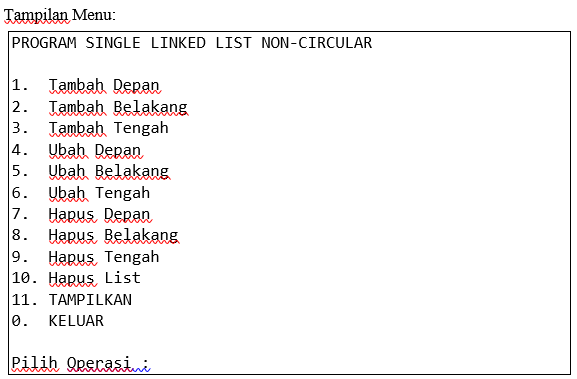 
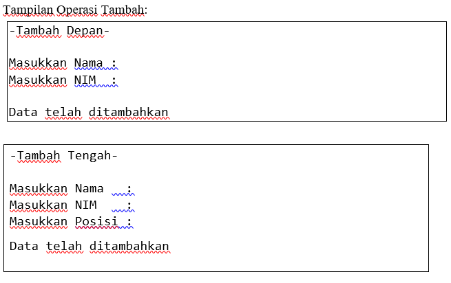 
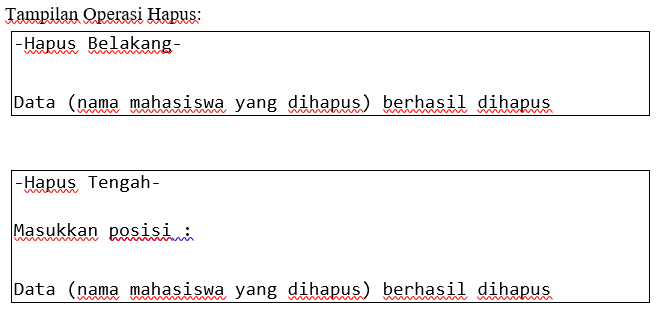 
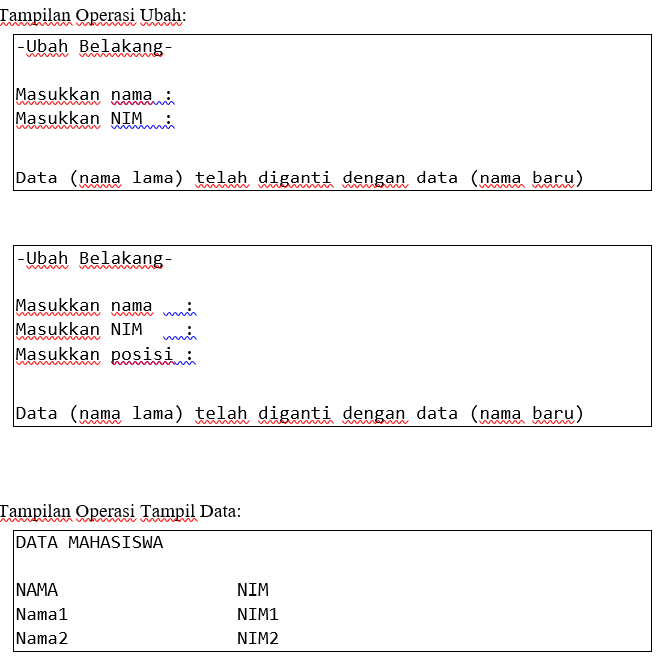

```C++
#include <iostream>
#include <iomanip>
using namespace std;

struct Node {
    string nama_122; // Mengubah variabel nama menjadi nama_122
    string nim;
    Node* next;
};

class LinkedList {
private:
    Node* head;

public:
    LinkedList() {
        head = NULL;
    }

    void tambahDepan(string nama_122, string nim) { // Mengubah variabel nama menjadi nama_122
        Node* newNode = new Node;
        newNode->nama_122 = nama_122; // Mengubah variabel nama menjadi nama_122
        newNode->nim = nim;
        newNode->next = head;
        head = newNode;
    }

    void tambahBelakang(string nama_122, string nim) { // Mengubah variabel nama menjadi nama_122
        Node* newNode = new Node;
        newNode->nama_122 = nama_122; // Mengubah variabel nama menjadi nama_122
        newNode->nim = nim;
        newNode->next = NULL;

        if (head == NULL) {
            head = newNode;
            return;
        }

        Node* temp = head;
        while (temp->next != NULL) {
            temp = temp->next;
        }
        temp->next = newNode;
    }

    void tambahTengah(string nama_122, string nim, int posisi) { // Mengubah variabel nama menjadi nama_122
        if (posisi <= 0) {
            cout << "Posisi harus lebih dari 0." << endl;
            return;
        }

        if (posisi == 1) {
            tambahDepan(nama_122, nim); // Mengubah variabel nama menjadi nama_122
            return;
        }

        Node* newNode = new Node;
        newNode->nama_122 = nama_122; // Mengubah variabel nama menjadi nama_122
        newNode->nim = nim;

        Node* temp = head;
        for (int i = 1; i < posisi - 1; i++) {
            if (temp == NULL) {
                cout << "Posisi tidak valid." << endl;
                return;
            }
            temp = temp->next;
        }

        newNode->next = temp->next;
        temp->next = newNode;
    }

    void hapusDepan() {
        if (head == NULL) {
            cout << "Linked list kosong." << endl;
            return;
        }

        Node* temp = head;
        head = head->next;
        delete temp;
    }

    void hapusBelakang() {
        if (head == NULL) {
            cout << "Linked list kosong." << endl;
            return;
        }

        if (head->next == NULL) {
            delete head;
            head = NULL;
            return;
        }

        Node* temp = head;
        while (temp->next->next != NULL) {
            temp = temp->next;
        }
        delete temp->next;
        temp->next = NULL;
    }

    void hapusTengah(int posisi) {
        if (posisi <= 0) {
            cout << "Posisi harus lebih dari 0." << endl;
            return;
        }

        if (posisi == 1) {
            hapusDepan();
            return;
        }

        Node* temp = head;
        for (int i = 1; i < posisi - 1; i++) {
            if (temp == NULL || temp->next == NULL) {
                cout << "Posisi tidak valid." << endl;
                return;
            }
            temp = temp->next;
        }

        Node* toDelete = temp->next;
        temp->next = temp->next->next;
        delete toDelete;
    }

    void hapusList() {
        while (head != NULL) {
            Node* temp = head;
            head = head->next;
            delete temp;
        }
        cout << "Seluruh list telah dihapus." << endl;
    }

    void ubahDepan(string namaLama, string namaBaru, string nimBaru) {
    Node* temp = head;
    while (temp != NULL) {
        if (temp->nama_122 == namaLama) { // Mengubah variabel nama menjadi nama_122
            temp->nama_122 = namaBaru; // Mengubah variabel nama menjadi nama_122
            temp->nim = nimBaru;
            return;
        }
        temp = temp->next;
    }
    cout << "Data dengan nama (" << namaLama << ") tidak ditemukan." << endl;
}

void ubahBelakang(string namaLama, string namaBaru, string nimBaru) {
    if (head == NULL) {
        cout << "Linked list kosong." << endl;
        return;
    }

    Node* temp = head;
  
    while (temp != NULL) {
        if (temp->nama_122 == namaLama) { // Mengubah variabel nama menjadi nama_122
            temp->nama_122 = namaBaru; // Mengubah variabel nama menjadi nama_122
            temp->nim = nimBaru;
            return;
        }
        temp = temp->next;
    }
    cout << "Data dengan nama " << namaLama << " tidak ditemukan." << endl;
}

void ubahTengah(int posisi, string namaLama, string namaBaru, string nimBaru) {
    if (posisi <= 0) {
        cout << "Posisi harus lebih dari 0." << endl;
        return;
    }

    Node* temp = head;
    for (int i = 1; i < posisi; i++) {
        if (temp == NULL) {
            cout << "Posisi tidak valid." << endl;
            return;
        }
        temp = temp->next;
    }

    if (temp != NULL) {
        temp->nama_122 = namaBaru; // Mengubah variabel nama menjadi nama_122
        temp->nim = nimBaru;
    } else {
        cout << "Posisi tidak valid." << endl;
    }
}

    void tampilkan() {
        if (head == NULL) {
            cout << "Linked list kosong." << endl;
            return;
        }
        Node* temp = head;
        cout << "==============================" << endl;
        cout << "|        LIST MAHASISWA      |" << endl;
        cout << "==============================" << endl;
        cout << "|       Nama    |     NIM    |" << endl;
        cout << "==============================" << endl;
        while (temp) {
            cout << "| " << setw(13) << left << temp->nama_122 << " | " << setw(10) << right << temp->nim << " |" << endl; // Mengubah variabel nama menjadi nama_122
            temp = temp->next;
        }
        cout << "==============================" << endl;\
    }
};

int main() {
    LinkedList I;
    int pilihan;
    string nama_122, nim, namabaru; // Mengubah variabel nama menjadi nama_122
    int posisi;


    do {
        cout << endl;
        cout << "============================" << endl;
        cout << "|PROGRAM SINGLE LINKED LIST|" << endl;
        cout << "|       NON-CIRCULAR       |" << endl;
        cout << "============================" << endl;
        cout << "|1. | Tambah Depan         |" << endl;
        cout << "|2. | Tambah Belakang      |" << endl;
        cout << "|3. | Tambah Tengah        |" << endl;
        cout << "|4. | Ubah Depan           |" << endl;
        cout << "|5. | Ubah Belakang        |" << endl;
        cout << "|6. | Ubah Tengah          |" << endl;
        cout << "|7. | Hapus Depan          |" << endl;
        cout << "|8. | Hapus Belakang       |" << endl;
        cout << "|9. | Hapus Tengah         |" << endl;
        cout << "|10.| Hapus List           |" << endl;
        cout << "|11.| Tampilkan Data       |" << endl;
        cout << "|0. | Keluar               |" << endl;
        cout << "============================" << endl;
        cout << endl;
        cout << "Pilih Operasi: ";
        cin >> pilihan;
        

        switch (pilihan) {
            case 1:
                cout << "-Tambah Depan-" << endl;
                cout << "Masukkan Nama: ";
                cin >> nama_122; // Mengubah variabel nama menjadi nama_122
                cout << "Masukkan NIM: ";
                cin >> nim;
                I.tambahDepan(nama_122, nim); // Mengubah variabel nama menjadi nama_122
                cout << "Data telah ditambahkan" << endl;
                break;
            case 2:
                cout << "-Tambah Belakang-" << endl;
                cout << "Masukkan Nama: ";
                cin >> nama_122; // Mengubah variabel nama menjadi nama_122
                cout << "Masukkan NIM: ";
                cin >> nim;
                I.tambahBelakang(nama_122, nim); // Mengubah variabel nama menjadi nama_122
                cout << "Data telah ditambahkan" << endl;
                break;
            case 3:
                cout << "-Tambah Tengah-" << endl;
                cout << "Masukkan Nama: ";
                cin >> nama_122; // Mengubah variabel nama menjadi nama_122
                cout << "Masukkan NIM: ";
                cin >> nim;
                cout << "Masukkan Posisi: ";
                cin >> posisi;
                I.tambahTengah(nama_122, nim, posisi); // Mengubah variabel nama menjadi nama_122
                cout << "Data telah ditambahkan" << endl;
                break;
            case 4:
                cout << "-Ubah Depan-" << endl;
                cout << "Masukkan Nama Lama: ";
                cin >> nama_122; // Mengubah variabel nama menjadi nama_122
                cout << "Masukkan Nama Baru: ";
                cin >> namabaru;
                cout << "Masukkan NIM Baru: ";
                cin >> nim;
                I.ubahDepan(nama_122, namabaru, nim); // Mengubah variabel nama menjadi nama_122
                cout << "Data " << nama_122 << " telah diubah menjadi " << namabaru << endl;
                break;
            case 5:
                cout << "-Ubah Belakang-" << endl;
                cout << "Masukkan Nama Lama: ";
                cin >> nama_122; // Mengubah variabel nama menjadi nama_122
                cout << "Masukkan Nama Baru: ";
                cin >> namabaru;
                cout << "Masukkan NIM Baru: ";
                cin >> nim;
                I.ubahBelakang(nama_122, namabaru, nim); // Mengubah variabel nama menjadi nama_122
                cout << "Data " << nama_122 << " telah diubah menjadi " << namabaru << endl;
                break;
            case 6:
                cout << "-Ubah Tengah-" << endl;
                cout << "Masukkan Posisi: ";
                cin >> posisi;
                cout << "Masukkan Nama Baru: ";
                cin >> namabaru;
                cout << "Masukkan NIM Baru: ";
                cin >> nim;
                I.ubahTengah(posisi, nama_122, namabaru, nim); // Mengubah variabel nama menjadi nama_122
                  cout << "Data" << nama_122 << " telah diubah menjadi " << namabaru << endl;
                break;
            case 7:
                cout << "-Hapus Depan-" << endl;
                I.hapusDepan();
                cout << "Data depan berhasil dihapus" << endl;
                break;
            case 8:
                cout << "-Hapus Belakang-" << endl;
                I.hapusBelakang();
                cout << "Data belakang berhasil dihapus" << endl;
                break;
            case 9:
                cout << "-Hapus Tengah-" << endl;
                cout << "Masukkan Posisi: ";
                cin >> posisi;
                I.hapusTengah(posisi);
                cout << "Data tengah berhasil dihapus" << endl;
                break;
            case 10:
                cout << "-Hapus List-" << endl;
                I.hapusList();
                break;
            case 11:
                cout << "-Tampilkan Data-" << endl;
                I.tampilkan();
                break;
            case 0:
                cout << "Program selesai." << endl;
                break;
            default:
                cout << "Pilihan tidak valid!" << endl;
                
        }
    } while (pilihan != 0);

    return 0;
}

```
### output:
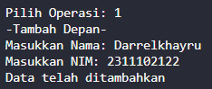
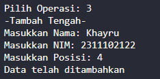
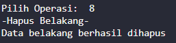
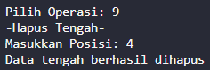
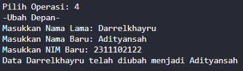
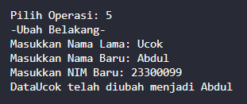
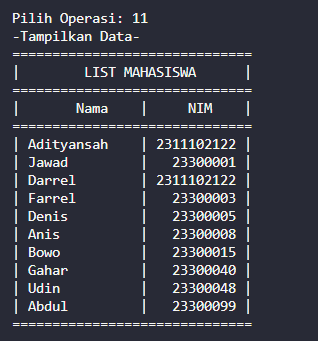
=> Penjelasan Program
 Program melakukan operasi dasar seperti menambah, menghapus, dan memperbarui data mahasiswa. Struktur data linked list digunakan untuk menyimpan informasi setiap mahasiswa dalam simpul (node) yang terdiri dari nama dan NIM. Setiap operasi yang dilakukan, seperti penambahan atau penghapusan, memberikan feedback kepada pengguna apakah operasi berhasil atau tidak. Program juga memvalidasi input pengguna untuk memastikan operasi yang dilakukan sesuai dengan aturan yang ditetapkan.


### 2. [Setelah membuat menu tersebut, masukkan data sesuai urutan berikut, lalu tampilkan data yang telah dimasukkan. (Gunakan insert depan, belakang atau tengah)]
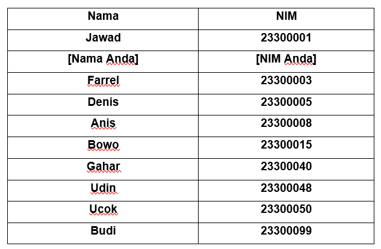


```C++
#include <iostream>
#include <iomanip>
using namespace std;

struct Node {
    string nama_122; // Mengubah variabel nama menjadi nama_122
    string nim;
    Node* next;
};

class LinkedList {
private:
    Node* head;

public:
    LinkedList() {
        head = NULL;
    }

    void tambahDepan(string nama_122, string nim) { // Mengubah variabel nama menjadi nama_122
        Node* newNode = new Node;
        newNode->nama_122 = nama_122; // Mengubah variabel nama menjadi nama_122
        newNode->nim = nim;
        newNode->next = head;
        head = newNode;
    }

    void tambahBelakang(string nama_122, string nim) { // Mengubah variabel nama menjadi nama_122
        Node* newNode = new Node;
        newNode->nama_122 = nama_122; // Mengubah variabel nama menjadi nama_122
        newNode->nim = nim;
        newNode->next = NULL;

        if (head == NULL) {
            head = newNode;
            return;
        }

        Node* temp = head;
        while (temp->next != NULL) {
            temp = temp->next;
        }
        temp->next = newNode;
    }

    void tambahTengah(string nama_122, string nim, int posisi) { // Mengubah variabel nama menjadi nama_122
        if (posisi <= 0) {
            cout << "Posisi harus lebih dari 0." << endl;
            return;
        }

        if (posisi == 1) {
            tambahDepan(nama_122, nim); // Mengubah variabel nama menjadi nama_122
            return;
        }

        Node* newNode = new Node;
        newNode->nama_122 = nama_122; // Mengubah variabel nama menjadi nama_122
        newNode->nim = nim;

        Node* temp = head;
        for (int i = 1; i < posisi - 1; i++) {
            if (temp == NULL) {
                cout << "Posisi tidak valid." << endl;
                return;
            }
            temp = temp->next;
        }

        newNode->next = temp->next;
        temp->next = newNode;
    }

    void hapusDepan() {
        if (head == NULL) {
            cout << "Linked list kosong." << endl;
            return;
        }

        Node* temp = head;
        head = head->next;
        delete temp;
    }

    void hapusBelakang() {
        if (head == NULL) {
            cout << "Linked list kosong." << endl;
            return;
        }

        if (head->next == NULL) {
            delete head;
            head = NULL;
            return;
        }

        Node* temp = head;
        while (temp->next->next != NULL) {
            temp = temp->next;
        }
        delete temp->next;
        temp->next = NULL;
    }

    void hapusTengah(int posisi) {
        if (posisi <= 0) {
            cout << "Posisi harus lebih dari 0." << endl;
            return;
        }

        if (posisi == 1) {
            hapusDepan();
            return;
        }

        Node* temp = head;
        for (int i = 1; i < posisi - 1; i++) {
            if (temp == NULL || temp->next == NULL) {
                cout << "Posisi tidak valid." << endl;
                return;
            }
            temp = temp->next;
        }

        Node* toDelete = temp->next;
        temp->next = temp->next->next;
        delete toDelete;
    }

    void hapusList() {
        while (head != NULL) {
            Node* temp = head;
            head = head->next;
            delete temp;
        }
        cout << "Seluruh list telah dihapus." << endl;
    }

    void ubahDepan(string namaLama, string namaBaru, string nimBaru) {
    Node* temp = head;
    while (temp != NULL) {
        if (temp->nama_122 == namaLama) { // Mengubah variabel nama menjadi nama_122
            temp->nama_122 = namaBaru; // Mengubah variabel nama menjadi nama_122
            temp->nim = nimBaru;
            return;
        }
        temp = temp->next;
    }
    cout << "Data dengan nama (" << namaLama << ") tidak ditemukan." << endl;
}

void ubahBelakang(string namaLama, string namaBaru, string nimBaru) {
    if (head == NULL) {
        cout << "Linked list kosong." << endl;
        return;
    }

    Node* temp = head;
  
    while (temp != NULL) {
        if (temp->nama_122 == namaLama) { // Mengubah variabel nama menjadi nama_122
            temp->nama_122 = namaBaru; // Mengubah variabel nama menjadi nama_122
            temp->nim = nimBaru;
            return;
        }
        temp = temp->next;
    }
    cout << "Data dengan nama " << namaLama << " tidak ditemukan." << endl;
}

void ubahTengah(int posisi, string namaLama, string namaBaru, string nimBaru) {
    if (posisi <= 0) {
        cout << "Posisi harus lebih dari 0." << endl;
        return;
    }

    Node* temp = head;
    for (int i = 1; i < posisi; i++) {
        if (temp == NULL) {
            cout << "Posisi tidak valid." << endl;
            return;
        }
        temp = temp->next;
    }

    if (temp != NULL) {
        temp->nama_122 = namaBaru; // Mengubah variabel nama menjadi nama_122
        temp->nim = nimBaru;
    } else {
        cout << "Posisi tidak valid." << endl;
    }
}

    void tampilkan() {
        if (head == NULL) {
            cout << "Linked list kosong." << endl;
            return;
        }
        Node* temp = head;
        cout << "==============================" << endl;
        cout << "|        LIST MAHASISWA      |" << endl;
        cout << "==============================" << endl;
        cout << "|       Nama    |     NIM    |" << endl;
        cout << "==============================" << endl;
        while (temp) {
            cout << "| " << setw(13) << left << temp->nama_122 << " | " << setw(10) << right << temp->nim << " |" << endl; // Mengubah variabel nama menjadi nama_122
            temp = temp->next;
        }
        cout << "==============================" << endl;\
    }
};

int main() {
    LinkedList I;
    int pilihan;
    string nama_122, nim, namabaru; // Mengubah variabel nama menjadi nama_122
    int posisi;


    do {
        cout << endl;
        cout << "============================" << endl;
        cout << "|PROGRAM SINGLE LINKED LIST|" << endl;
        cout << "|       NON-CIRCULAR       |" << endl;
        cout << "============================" << endl;
        cout << "|1. | Tambah Depan         |" << endl;
        cout << "|2. | Tambah Belakang      |" << endl;
        cout << "|3. | Tambah Tengah        |" << endl;
        cout << "|4. | Ubah Depan           |" << endl;
        cout << "|5. | Ubah Belakang        |" << endl;
        cout << "|6. | Ubah Tengah          |" << endl;
        cout << "|7. | Hapus Depan          |" << endl;
        cout << "|8. | Hapus Belakang       |" << endl;
        cout << "|9. | Hapus Tengah         |" << endl;
        cout << "|10.| Hapus List           |" << endl;
        cout << "|11.| Tampilkan Data       |" << endl;
        cout << "|0. | Keluar               |" << endl;
        cout << "============================" << endl;
        cout << endl;
        cout << "Pilih Operasi: ";
        cin >> pilihan;
        

        switch (pilihan) {
            case 1:
                cout << "-Tambah Depan-" << endl;
                cout << "Masukkan Nama: ";
                cin >> nama_122; // Mengubah variabel nama menjadi nama_122
                cout << "Masukkan NIM: ";
                cin >> nim;
                I.tambahDepan(nama_122, nim); // Mengubah variabel nama menjadi nama_122
                cout << "Data telah ditambahkan" << endl;
                break;
            case 2:
                cout << "-Tambah Belakang-" << endl;
                cout << "Masukkan Nama: ";
                cin >> nama_122; // Mengubah variabel nama menjadi nama_122
                cout << "Masukkan NIM: ";
                cin >> nim;
                I.tambahBelakang(nama_122, nim); // Mengubah variabel nama menjadi nama_122
                cout << "Data telah ditambahkan" << endl;
                break;
            case 3:
                cout << "-Tambah Tengah-" << endl;
                cout << "Masukkan Nama: ";
                cin >> nama_122; // Mengubah variabel nama menjadi nama_122
                cout << "Masukkan NIM: ";
                cin >> nim;
                cout << "Masukkan Posisi: ";
                cin >> posisi;
                I.tambahTengah(nama_122, nim, posisi); // Mengubah variabel nama menjadi nama_122
                cout << "Data telah ditambahkan" << endl;
                break;
            case 4:
                cout << "-Ubah Depan-" << endl;
                cout << "Masukkan Nama Lama: ";
                cin >> nama_122; // Mengubah variabel nama menjadi nama_122
                cout << "Masukkan Nama Baru: ";
                cin >> namabaru;
                cout << "Masukkan NIM Baru: ";
                cin >> nim;
                I.ubahDepan(nama_122, namabaru, nim); // Mengubah variabel nama menjadi nama_122
                cout << "Data " << nama_122 << " telah diubah menjadi " << namabaru << endl;
                break;
            case 5:
                cout << "-Ubah Belakang-" << endl;
                cout << "Masukkan Nama Lama: ";
                cin >> nama_122; // Mengubah variabel nama menjadi nama_122
                cout << "Masukkan Nama Baru: ";
                cin >> namabaru;
                cout << "Masukkan NIM Baru: ";
                cin >> nim;
                I.ubahBelakang(nama_122, namabaru, nim); // Mengubah variabel nama menjadi nama_122
                cout << "Data " << nama_122 << " telah diubah menjadi " << namabaru << endl;
                break;
            case 6:
                cout << "-Ubah Tengah-" << endl;
                cout << "Masukkan Posisi: ";
                cin >> posisi;
                cout << "Masukkan Nama Baru: ";
                cin >> namabaru;
                cout << "Masukkan NIM Baru: ";
                cin >> nim;
                I.ubahTengah(posisi, nama_122, namabaru, nim); // Mengubah variabel nama menjadi nama_122
                  cout << "Data" << nama_122 << " telah diubah menjadi " << namabaru << endl;
                break;
            case 7:
                cout << "-Hapus Depan-" << endl;
                I.hapusDepan();
                cout << "Data depan berhasil dihapus" << endl;
                break;
            case 8:
                cout << "-Hapus Belakang-" << endl;
                I.hapusBelakang();
                cout << "Data belakang berhasil dihapus" << endl;
                break;
            case 9:
                cout << "-Hapus Tengah-" << endl;
                cout << "Masukkan Posisi: ";
                cin >> posisi;
                I.hapusTengah(posisi);
                cout << "Data tengah berhasil dihapus" << endl;
                break;
            case 10:
                cout << "-Hapus List-" << endl;
                I.hapusList();
                break;
            case 11:
                cout << "-Tampilkan Data-" << endl;
                I.tampilkan();
                break;
            case 0:
                cout << "Program selesai." << endl;
                break;
            default:
                cout << "Pilihan tidak valid!" << endl;
                
        }
    } while (pilihan != 0);

    return 0;
}
```

### output :
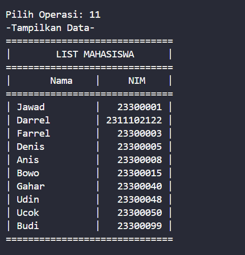
=> Penjelasan Program
Program menggunakan struktur data Node untuk merepresentasikan simpul (node) dalam linked list, yang setiap simpulnya berisi informasi nama dan NIM mahasiswa serta pointer yang menunjuk ke simpul berikutnya. Kelas LinkedList menyediakan fungsi-fungsi seperti tambahDepan, tambahBelakang, tambahTengah, hapusDepan, hapusBelakang, hapusTengah, ubahDepan, ubahBelakang, ubahTengah, dan tampilkan untuk melakukan operasi penambahan, penghapusan, pemutakhiran, dan penampilan data dalam linked list.


### 3. [Lakukan perintah berikut:]
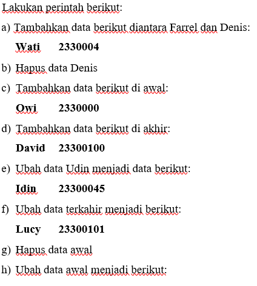

```C++
#include <iostream>
#include <iomanip>
using namespace std;

struct Node {
    string nama_122; // Mengubah variabel nama menjadi nama_122
    string nim;
    Node* next;
};

class LinkedList {
private:
    Node* head;

public:
    LinkedList() {
        head = NULL;
    }

    void tambahDepan(string nama_122, string nim) { // Mengubah variabel nama menjadi nama_122
        Node* newNode = new Node;
        newNode->nama_122 = nama_122; // Mengubah variabel nama menjadi nama_122
        newNode->nim = nim;
        newNode->next = head;
        head = newNode;
    }

    void tambahBelakang(string nama_122, string nim) { // Mengubah variabel nama menjadi nama_122
        Node* newNode = new Node;
        newNode->nama_122 = nama_122; // Mengubah variabel nama menjadi nama_122
        newNode->nim = nim;
        newNode->next = NULL;

        if (head == NULL) {
            head = newNode;
            return;
        }

        Node* temp = head;
        while (temp->next != NULL) {
            temp = temp->next;
        }
        temp->next = newNode;
    }

    void tambahTengah(string nama_122, string nim, int posisi) { // Mengubah variabel nama menjadi nama_122
        if (posisi <= 0) {
            cout << "Posisi harus lebih dari 0." << endl;
            return;
        }

        if (posisi == 1) {
            tambahDepan(nama_122, nim); // Mengubah variabel nama menjadi nama_122
            return;
        }

        Node* newNode = new Node;
        newNode->nama_122 = nama_122; // Mengubah variabel nama menjadi nama_122
        newNode->nim = nim;

        Node* temp = head;
        for (int i = 1; i < posisi - 1; i++) {
            if (temp == NULL) {
                cout << "Posisi tidak valid." << endl;
                return;
            }
            temp = temp->next;
        }

        newNode->next = temp->next;
        temp->next = newNode;
    }

    void hapusDepan() {
        if (head == NULL) {
            cout << "Linked list kosong." << endl;
            return;
        }

        Node* temp = head;
        head = head->next;
        delete temp;
    }

    void hapusBelakang() {
        if (head == NULL) {
            cout << "Linked list kosong." << endl;
            return;
        }

        if (head->next == NULL) {
            delete head;
            head = NULL;
            return;
        }

        Node* temp = head;
        while (temp->next->next != NULL) {
            temp = temp->next;
        }
        delete temp->next;
        temp->next = NULL;
    }

    void hapusTengah(int posisi) {
        if (posisi <= 0) {
            cout << "Posisi harus lebih dari 0." << endl;
            return;
        }

        if (posisi == 1) {
            hapusDepan();
            return;
        }

        Node* temp = head;
        for (int i = 1; i < posisi - 1; i++) {
            if (temp == NULL || temp->next == NULL) {
                cout << "Posisi tidak valid." << endl;
                return;
            }
            temp = temp->next;
        }

        Node* toDelete = temp->next;
        temp->next = temp->next->next;
        delete toDelete;
    }

    void hapusList() {
        while (head != NULL) {
            Node* temp = head;
            head = head->next;
            delete temp;
        }
        cout << "Seluruh list telah dihapus." << endl;
    }

    void ubahDepan(string namaLama, string namaBaru, string nimBaru) {
    Node* temp = head;
    while (temp != NULL) {
        if (temp->nama_122 == namaLama) { // Mengubah variabel nama menjadi nama_122
            temp->nama_122 = namaBaru; // Mengubah variabel nama menjadi nama_122
            temp->nim = nimBaru;
            return;
        }
        temp = temp->next;
    }
    cout << "Data dengan nama (" << namaLama << ") tidak ditemukan." << endl;
}

void ubahBelakang(string namaLama, string namaBaru, string nimBaru) {
    if (head == NULL) {
        cout << "Linked list kosong." << endl;
        return;
    }

    Node* temp = head;
  
    while (temp != NULL) {
        if (temp->nama_122 == namaLama) { // Mengubah variabel nama menjadi nama_122
            temp->nama_122 = namaBaru; // Mengubah variabel nama menjadi nama_122
            temp->nim = nimBaru;
            return;
        }
        temp = temp->next;
    }
    cout << "Data dengan nama " << namaLama << " tidak ditemukan." << endl;
}

void ubahTengah(int posisi, string namaLama, string namaBaru, string nimBaru) {
    if (posisi <= 0) {
        cout << "Posisi harus lebih dari 0." << endl;
        return;
    }

    Node* temp = head;
    for (int i = 1; i < posisi; i++) {
        if (temp == NULL) {
            cout << "Posisi tidak valid." << endl;
            return;
        }
        temp = temp->next;
    }

    if (temp != NULL) {
        temp->nama_122 = namaBaru; // Mengubah variabel nama menjadi nama_122
        temp->nim = nimBaru;
    } else {
        cout << "Posisi tidak valid." << endl;
    }
}

    void tampilkan() {
        if (head == NULL) {
            cout << "Linked list kosong." << endl;
            return;
        }
        Node* temp = head;
        cout << "==============================" << endl;
        cout << "|        LIST MAHASISWA      |" << endl;
        cout << "==============================" << endl;
        cout << "|       Nama    |     NIM    |" << endl;
        cout << "==============================" << endl;
        while (temp) {
            cout << "| " << setw(13) << left << temp->nama_122 << " | " << setw(10) << right << temp->nim << " |" << endl; // Mengubah variabel nama menjadi nama_122
            temp = temp->next;
        }
        cout << "==============================" << endl;\
    }
};

int main() {
    LinkedList I;
    int pilihan;
    string nama_122, nim, namabaru; // Mengubah variabel nama menjadi nama_122
    int posisi;


    do {
        cout << endl;
        cout << "============================" << endl;
        cout << "|PROGRAM SINGLE LINKED LIST|" << endl;
        cout << "|       NON-CIRCULAR       |" << endl;
        cout << "============================" << endl;
        cout << "|1. | Tambah Depan         |" << endl;
        cout << "|2. | Tambah Belakang      |" << endl;
        cout << "|3. | Tambah Tengah        |" << endl;
        cout << "|4. | Ubah Depan           |" << endl;
        cout << "|5. | Ubah Belakang        |" << endl;
        cout << "|6. | Ubah Tengah          |" << endl;
        cout << "|7. | Hapus Depan          |" << endl;
        cout << "|8. | Hapus Belakang       |" << endl;
        cout << "|9. | Hapus Tengah         |" << endl;
        cout << "|10.| Hapus List           |" << endl;
        cout << "|11.| Tampilkan Data       |" << endl;
        cout << "|0. | Keluar               |" << endl;
        cout << "============================" << endl;
        cout << endl;
        cout << "Pilih Operasi: ";
        cin >> pilihan;
        

        switch (pilihan) {
            case 1:
                cout << "-Tambah Depan-" << endl;
                cout << "Masukkan Nama: ";
                cin >> nama_122; // Mengubah variabel nama menjadi nama_122
                cout << "Masukkan NIM: ";
                cin >> nim;
                I.tambahDepan(nama_122, nim); // Mengubah variabel nama menjadi nama_122
                cout << "Data telah ditambahkan" << endl;
                break;
            case 2:
                cout << "-Tambah Belakang-" << endl;
                cout << "Masukkan Nama: ";
                cin >> nama_122; // Mengubah variabel nama menjadi nama_122
                cout << "Masukkan NIM: ";
                cin >> nim;
                I.tambahBelakang(nama_122, nim); // Mengubah variabel nama menjadi nama_122
                cout << "Data telah ditambahkan" << endl;
                break;
            case 3:
                cout << "-Tambah Tengah-" << endl;
                cout << "Masukkan Nama: ";
                cin >> nama_122; // Mengubah variabel nama menjadi nama_122
                cout << "Masukkan NIM: ";
                cin >> nim;
                cout << "Masukkan Posisi: ";
                cin >> posisi;
                I.tambahTengah(nama_122, nim, posisi); // Mengubah variabel nama menjadi nama_122
                cout << "Data telah ditambahkan" << endl;
                break;
            case 4:
                cout << "-Ubah Depan-" << endl;
                cout << "Masukkan Nama Lama: ";
                cin >> nama_122; // Mengubah variabel nama menjadi nama_122
                cout << "Masukkan Nama Baru: ";
                cin >> namabaru;
                cout << "Masukkan NIM Baru: ";
                cin >> nim;
                I.ubahDepan(nama_122, namabaru, nim); // Mengubah variabel nama menjadi nama_122
                cout << "Data " << nama_122 << " telah diubah menjadi " << namabaru << endl;
                break;
            case 5:
                cout << "-Ubah Belakang-" << endl;
                cout << "Masukkan Nama Lama: ";
                cin >> nama_122; // Mengubah variabel nama menjadi nama_122
                cout << "Masukkan Nama Baru: ";
                cin >> namabaru;
                cout << "Masukkan NIM Baru: ";
                cin >> nim;
                I.ubahBelakang(nama_122, namabaru, nim); // Mengubah variabel nama menjadi nama_122
                cout << "Data " << nama_122 << " telah diubah menjadi " << namabaru << endl;
                break;
            case 6:
                cout << "-Ubah Tengah-" << endl;
                cout << "Masukkan Posisi: ";
                cin >> posisi;
                cout << "Masukkan Nama Baru: ";
                cin >> namabaru;
                cout << "Masukkan NIM Baru: ";
                cin >> nim;
                I.ubahTengah(posisi, nama_122, namabaru, nim); // Mengubah variabel nama menjadi nama_122
                  cout << "Data" << nama_122 << " telah diubah menjadi " << namabaru << endl;
                break;
            case 7:
                cout << "-Hapus Depan-" << endl;
                I.hapusDepan();
                cout << "Data depan berhasil dihapus" << endl;
                break;
            case 8:
                cout << "-Hapus Belakang-" << endl;
                I.hapusBelakang();
                cout << "Data belakang berhasil dihapus" << endl;
                break;
            case 9:
                cout << "-Hapus Tengah-" << endl;
                cout << "Masukkan Posisi: ";
                cin >> posisi;
                I.hapusTengah(posisi);
                cout << "Data tengah berhasil dihapus" << endl;
                break;
            case 10:
                cout << "-Hapus List-" << endl;
                I.hapusList();
                break;
            case 11:
                cout << "-Tampilkan Data-" << endl;
                I.tampilkan();
                break;
            case 0:
                cout << "Program selesai." << endl;
                break;
            default:
                cout << "Pilihan tidak valid!" << endl;
                
        }
    } while (pilihan != 0);

    return 0;
}
```
### output :
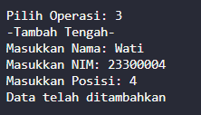
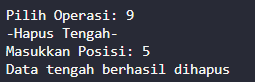
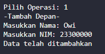
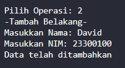
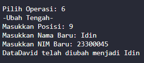
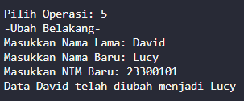
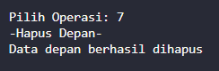
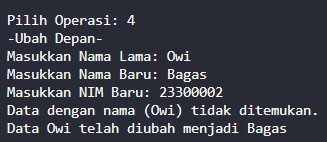
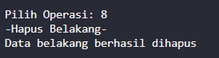
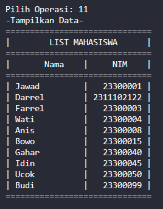
=> Penjelasan Program
program melakukan berbagai operasi seperti menambah, menghapus, mengubah, dan menampilkan data dalam linked list. Menu yang disediakan memungkinkan pengguna untuk memilih operasi yang ingin dilakukan, seperti menambahkan data di awal, di tengah, atau di akhir, serta menghapus data dari depan, belakang, atau tengah. Setiap operasi meminta input yang diperlukan dari pengguna dan menghasilkan output sesuai dengan permintaan.

## Kesimpulan
linked list non circular dan linked list circular keduanya memiliki struktur dasar yang mirip namun memiliki karakteristik yang berbeda dalam hal penyelesaian pengulangan dan penanganan node terakhir. linked list circular tidak memiliki akhir yang jelas karena node terakhirnya terhubung kembali ke node pertama, memungkinkan untuk pengulangan data tanpa akhir dalam aplikasi seperti daftar putar atau antrian. Pemahaman karakteristik masing-masing jenis linked list penting untuk memilih implementasi yang sesuai dengan kebutuhan aplikasi yang diinginkan.

## Referensi
[1] Johnson Sihombing. (2019). PENERAPAN STACK DAN QUEUE PADA ARRAY DAN LINKED LIST DALAM JAVA
[2] Circular Linked List. (Diakses pada tanggal 1 april 2024). https://ulinngaprakyublog.wordpress.com/2020/05/12/circular-linked-list/
[3] Introduction to Circular Linked List. (Diakses pada tangga 1 april 2024). https://www.geeksforgeeks.org/circular-linked-list/
