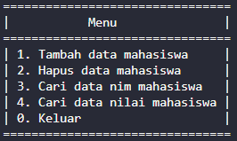
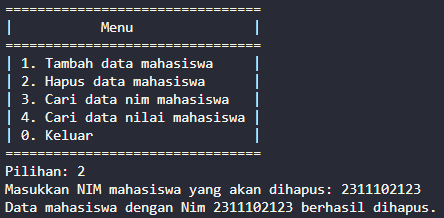
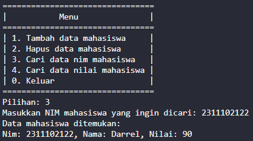
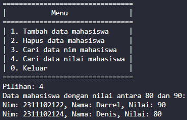
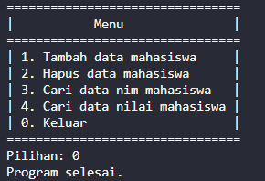

# <h1 align="center">Laporan Praktikum Modul HASH TABLE</h1>

<p align="center">DARREL KHAYRU ADITYANSAH</p>
<p align="center">2311102122</p>

## Dasar Teori
Hash table merupakan struktur data yang secara asosiatif menyimpan data. Dalam hal ini, data disimpan dalam format array, di mana setiap nilai data memiliki nilai indeks uniknya sendiri. Akses data akan menjadi sangat cepat jika Anda mengetahui indeks dari data yang diinginkan. 

Fungsi yang menerjemahkan kunci ke indeks array dikenal sebagai fungsi hash. Kunci harus didistribusikan secara merata ke seluruh array melalui fungsi hash yang layak untuk mengurangi tabrakan dan memastikan kecepatan pencarian yang cepat.

- Asumsi bilangan bulat semesta: Kunci diasumsikan bilangan bulat dalam rentang tertentu sesuai dengan asumsi bilangan bulat semesta. Hal ini memungkinkan penggunaan operasi hashing dasar seperti hashing pembagian atau perkalian.
- Hashing berdasarkan pembagian: Teknik hashing langsung ini menggunakan sisa nilai kunci setelah membaginya dengan ukuran array sebagai indeks. Jika ukuran array adalah bilangan prima dan jarak kuncinya sama, kinerjanya akan baik.
- Hashing dengan perkalian: Operasi hashing langsung ini mengalikan kunci dengan konstanta antara 0 dan 1 sebelum mengambil bagian pecahan dari hasilnya. Setelah itu, indeks ditentukan dengan mengalikan komponen pecahan dengan ukuran array. Selain itu, berfungsi secara efektif bila tombol tersebar secara merata.

Operasi dalam Struktur Data Hash Table
Pencarian (Search): Digunakan untuk mencari elemen/data dalam Hash Table berdasarkan kunci atau indeksnya. Pencarian dilakukan dengan menggunakan fungsi hash untuk menghasilkan indeks elemen yang dicari.
Penyisipan (Insertion): Operasi ini digunakan untuk menyisipkan elemen/data baru ke dalam Hash Table. Elemen baru akan ditempatkan pada indeks yang dihasilkan oleh fungsi hash.
Penghapusan (Deletion): Digunakan untuk menghapus elemen/data dari Hash Table berdasarkan kunci atau indeksnya. Elemen yang dihapus akan dihapus dari indeks yang dihasilkan oleh fungsi hash.
Update: Operasi ini digunakan untuk mengubah nilai elemen/data yang sudah ada dalam Hash Table. Nilai elemen dapat diubah berdasarkan kunci atau indeksnya.
Collision Handling: Collision terjadi ketika dua atau lebih elemen memiliki indeks yang sama setelah melalui fungsi hash. Operasi ini digunakan untuk menangani collision dan memastikan bahwa elemen-elemen dengan indeks yang sama dapat disimpan dan diakses dengan benar.
Resize: Operasi ini digunakan untuk mengubah ukuran Hash Table jika jumlah elemen/data yang disimpan melebihi kapasitas yang ditentukan. Resize dilakukan untuk menjaga efisiensi dan kinerja Hash Table.
Iterasi: Operasi yang digunakan untuk mengakses dan memproses semua elemen/data yang ada dalam Hash Table secara berurutan.

## Guided 

### 1. [Guided 1]

```C++
#include <iostream>
using namespace std;

const int MAX_SIZE = 10;

// Fungsi hash sederhana
int hash_func(int key) {
    return key % MAX_SIZE;
}

// Struktur data untuk setiap node
struct Node {
    int key;
    int value;
    Node* next;
    Node(int key, int value) : key(key), value(value), next(nullptr) {}
};

// Class hash table
class HashTable {
private:
    Node** table;

public:
    HashTable() {
        table = new Node*[MAX_SIZE]();
    }

    ~HashTable() {
        for (int i = 0; i < MAX_SIZE; i++) {
            Node* current = table[i];
            while (current != nullptr) {
                Node* temp = current;
                current = current->next;
                delete temp;
            }
        }
        delete[] table;
    }

    // Insertion
    void insert(int key, int value) {
        int index = hash_func(key);
        Node* current = table[index];
        while (current != nullptr) {
            if (current->key == key) {
                current->value = value;
                return;
            }
            current = current->next;
        }

        Node* node = new Node(key, value);
        node->next = table[index];
        table[index] = node;
    }

    // Searching
    int get(int key) {
        int index = hash_func(key);
        Node* current = table[index];
        while (current != nullptr) {
            if (current->key == key) {
                return current->value;
            }
            current = current->next;
        }
        return -1;
    }

    // Deletion
    void remove(int key) {
        int index = hash_func(key);
        Node* current = table[index];
        Node* prev = nullptr;
        while (current != nullptr) {
            if (current->key == key) {
                if (prev == nullptr) {
                    table[index] = current->next;
                } else {
                    prev->next = current->next;
                }
                delete current;
                return;
            }
            prev = current;
            current = current->next;
        }
    }

    // Traversal
    void traverse() {
        for (int i = 0; i < MAX_SIZE; i++) {
            Node* current = table[i];
            while (current != nullptr) {
                cout << current->key << ": " << current->value << endl;
                current = current->next;
            }
        }
    }
};

int main() {
    HashTable ht;

    // Insertion
    ht.insert(1, 10);
    ht.insert(2, 20);
    ht.insert(3, 30);

    // Searching
    cout << "Get key 1: " << ht.get(1) << endl;
    cout << "Get key 4: " << ht.get(4) << endl;

    // Deletion
    ht.remove(4);

    // Traversal
    ht.traverse();

    return 0;
}
```
=> penjelasan Program
menyimpan pasangan kunci-nilai, di mana kunci dan nilai keduanya adalah integer. Setiap entri dalam hash table adalah sebuah linked list yang menyimpan node-node Node, yang memiliki kunci dan nilai. Kelas HashTable memiliki metode-metode untuk operasi dasar seperti penyisipan, pencarian, penghapusan, dan penelusuran. Fungsi hash sederhana digunakan untuk menentukan indeks di mana data akan disimpan dalam hash table. Program ini menunjukkan contoh penggunaan hash table dengan melakukan operasi-operasi dasar seperti penyisipan, pencarian, penghapusan, dan penelusuran.

### 2. [Guided 2]

```C++
#include <iostream>
#include <string>
#include <vector>
using namespace std;

const int TABLE_SIZE = 11;

class HashNode {
public:
    string name;
    string phone_number;
    
    HashNode(string name, string phone_number) {
        this->name = name;
        this->phone_number = phone_number;
    }
};

class HashMap {
private:
    vector<HashNode*> table[TABLE_SIZE];
    
public:
    int hashFunc(string key) {
        int hash_val = 0;
        for (char c : key) {
            hash_val += c;
        }
        return hash_val % TABLE_SIZE;
    }
    
    void insert(string name, string phone_number) {
        int hash_val = hashFunc(name);
        for (auto node : table[hash_val]) {
            if (node->name == name) {
                node->phone_number = phone_number;
                return;
            }
        }
        table[hash_val].push_back(new HashNode(name, phone_number));
    }
    
    void remove(string name) {
        int hash_val = hashFunc(name);
        for (auto it = table[hash_val].begin(); it != table[hash_val].end(); it++) {
            if ((*it)->name == name) {
                table[hash_val].erase(it);
                return;
            }
        }
    }
    
    string searchByName(string name) {
        int hash_val = hashFunc(name);
        for (auto node : table[hash_val]) {
            if (node->name == name) {
                return node->phone_number;
            }
        }
        return "";
    }
    
    void print() {
        for (int i = 0; i < TABLE_SIZE; i++) {
            cout << i << ": ";
            for (auto pair : table[i]) {
                if (pair != nullptr) {
                    cout << "[" << pair->name << ", " << pair->phone_number << "]";
                }
            }
            cout << endl;
        }
    }
};

int main() {
    HashMap employee_map;
    employee_map.insert("Mistah", "1234");
    employee_map.insert("Pastah", "5678");
    employee_map.insert("Ghana", "91011");
    
    cout << "Nomer Hp Mistah : " << employee_map.searchByName("Mistah") << endl;
    cout << "Nomer Hp Pastah : " << employee_map.searchByName("Pastah") << endl;
    
    employee_map.remove("Mistah");
    cout << "Nomer Hp Mistah setelah dihapus : " << employee_map.searchByName("Mistah") << endl << endl;
    
    cout << "Hash Table : " << endl;
    employee_map.print();
    
    return 0;
}
```
=> penjelasan Program 
menggunakan hash table untuk menyimpan data karyawan berdasarkan nama dan nomor telepon mereka. Setiap entri dalam hash table merupakan sebuah vektor yang menyimpan node-node HashNode, yang berisi nama dan nomor telepon. Program menyediakan fungsi-fungsi untuk menambah, menghapus, dan mencari data karyawan berdasarkan nama mereka. Fungsi hash sederhana digunakan untuk menghitung indeks dalam hash table berdasarkan nama karyawan. Program mencetak nomor telepon untuk karyawan tertentu, kemudian menghapus salah satu karyawan dan mencetak kembali isi hash table setelah penghapusan.

## Unguided 

### 1. [Implementasikan hash table untuk menyimpan data mahasiswa. Setiap mahasiswa memiliki NIM dan nilai. Implementasikan fungsi untuk menambahkan data baru, menghapus data, mencari data berdasarkan NIM, dan mencari data berdasarkan nilai. Dengan ketentuan]
a.	Setiap mahasiswa memiliki NIM dan nilai.
b.	Program memiliki tampilan pilihan menu berisi poin C. 
c.	Implementasikan fungsi untuk menambahkan data baru, menghapus data, mencari data berdasarkan NIM, dan mencari data berdasarkan rentang nilai (80 – 90). 


```C++
#include <iostream>
#include <vector>
#include <string>
using namespace std;

const int TABLE_SIZE = 10;

// Struktur data untuk setiap mahasiswa
struct Mahasiswa {
    string NIM;
    string nama;
    int nilai;
    Mahasiswa(string NIM, string nama, int nilai) : NIM(NIM), nama(nama), nilai(nilai) {}
};

// Node untuk setiap entri dalam hash table
struct HashNode {
    vector<Mahasiswa> mahasiswas;
};

// Class hash table
class HashTable {
private:
    HashNode table[TABLE_SIZE];

    // Fungsi hash sederhana
    int hashFunc(string key) {
        int hash_val = 0;
        for (char c : key) {
            hash_val += c;
        }
        return hash_val % TABLE_SIZE;
    }

public:
    // Menambahkan data mahasiswa
    void tambahMahasiswa(string NIM, string nama, int nilai) {
        int index = hashFunc(NIM);
        table[index].mahasiswas.push_back(Mahasiswa(NIM, nama, nilai));
    }

    // Menghapus data mahasiswa berdasarkan NIM
    void hapusMahasiswa(string NIM) {
        int index = hashFunc(NIM);
        vector<Mahasiswa>& mahasiswas = table[index].mahasiswas;
        for (auto it = mahasiswas.begin(); it != mahasiswas.end(); ++it) {
            if (it->NIM == NIM) {
                mahasiswas.erase(it);
                return;
            }
        }
    }

    // Mengakses table
    const HashNode* getTable() const {
        return table;
    }

    // Mencari data mahasiswa berdasarkan rentang nilai
    vector<Mahasiswa> cariNilaiMahasiswa(int minNilai, int maxNilai) {
        vector<Mahasiswa> ketemu;
        for (int i = 0; i < TABLE_SIZE; ++i) {
            for (auto& mahasiswa : table[i].mahasiswas) {
                if (mahasiswa.nilai >= minNilai && mahasiswa.nilai <= maxNilai) {
                    ketemu.push_back(mahasiswa);
                }
            }
        }
        return ketemu;
    }
};

// Fungsi untuk menampilkan menu dalam kotak
void tampilkanMenu() {
    cout << "================================" << endl;
    cout << "|           Menu               |" << endl;
    cout << "================================" << endl;
    cout << "| 1. Tambah data mahasiswa     |" << endl;
    cout << "| 2. Hapus data mahasiswa      |" << endl;
    cout << "| 3. Cari data nim mahasiswa   |" << endl;
    cout << "| 4. Cari data nilai mahasiswa |" << endl;
    cout << "| 0. Keluar                    |" << endl;
    cout << "================================" << endl;
    cout << "Pilihan: ";
}

int main() {
    HashTable ht;
    int pilihan;
    string NIM, nama;
    int nilai;
    int minNilai, maxNilai;
    vector<Mahasiswa> ketemu; // Inisialisasi vektor untuk menyimpan mahasiswa yang ditemukan
    bool ditemukan; // variabel ditemukan dideklarasikan di luar blok switch

    do {
        tampilkanMenu();
        cin >> pilihan;

        switch (pilihan) {
            case 1:
                cout << "Masukkan Nama: ";
                cin >> nama;
                cout << "Masukkan Nim: ";
                cin >> NIM;
                cout << "Masukkan Nilai: ";
                cin >> nilai;
                ht.tambahMahasiswa(NIM, nama, nilai);
                cout << "Data mahasiswa berhasil ditambahkan.\n";
                break;
            case 2:
                cout << "Masukkan NIM mahasiswa yang akan dihapus: ";
                cin >> NIM;
                ht.hapusMahasiswa(NIM);
                cout << "Data mahasiswa dengan Nim " << NIM << " berhasil dihapus.\n";
                break;
            case 3:
                cout << "Masukkan NIM mahasiswa yang ingin dicari: ";
                cin >> NIM;
                ditemukan = false; // Setel ulang variabel ditemukan sebelum digunakan
                for (int i = 0; i < TABLE_SIZE; ++i) {
                    for (auto& mahasiswa : ht.getTable()[i].mahasiswas) {
                        if (mahasiswa.NIM == NIM) {
                            cout << "Data mahasiswa ditemukan:\n";
                            cout << "Nim: " << mahasiswa.NIM << ", Nama: " << mahasiswa.nama << ", Nilai: " << mahasiswa.nilai << endl;
                            ditemukan = true; // Setel ke true jika mahasiswa ditemukan
                        }
                    }
                }
                if (!ditemukan) { // Jika mahasiswa tidak ditemukan, tampilkan pesan
                    cout << "Mahasiswa dengan NIM " << NIM << " tidak ditemukan.\n";
                }
                break;
            case 4:
                // Mencari mahasiswa berdasarkan rentang nilai (80 - 90)
                minNilai = 80;
                maxNilai = 90;
                ketemu = ht.cariNilaiMahasiswa(minNilai, maxNilai);
                if (!ketemu.empty()) {
                    cout << "Data mahasiswa dengan nilai antara 80 dan 90:\n";
                    for (const auto& mahasiswa : ketemu) {
                        cout << "Nim: " << mahasiswa.NIM << ", Nama: " << mahasiswa.nama << ", Nilai: " << mahasiswa.nilai << endl;
                    }
                } else {
                    cout << "Data mahasiswa dengan nilai antara 80 dan 90 tidak ditemukan.\n";
                }
                break;
            case 0:
                cout << "Program selesai.\n";
                break;
            default:
                cout << "Pilihan tidak valid.\n";
                break;
        }
    } while (pilihan != 0);

    return 0;
}
```
### output:










=> Penjelasan Program
Program untuk menyimpan data mahasiswa, setiap entri hash table memiliki vektor yang menyimpan mahasiswa. Fungsi hash sederhana digunakan untuk menghitung indeks berdasarkan NIM mahasiswa. Program menyediakan menu interaktif untuk menambah, menghapus, dan mencari data mahasiswa berdasarkan NIM atau rentang nilai. Loop utama dalam main menjalankan program hingga pengguna memilih untuk keluar.

## Kesimpulan
Hash table adalah struktur data yang efisien untuk menyimpan dan mengakses data secara asosiatif. Dalam hash table, data disimpan dalam array di mana setiap nilai memiliki indeks unik yang ditentukan oleh fungsi hash. Fungsi hash bertanggung jawab untuk menerjemahkan kunci data menjadi indeks array yang merata. Teknik hashing berdasarkan pembagian atau perkalian digunakan untuk mendistribusikan kunci secara merata ke seluruh array. Operasi dasar dalam hash table meliputi pencarian, penyisipan, penghapusan, dan pembaruan data. 

## Referensi
[1] Ega Patra Nugraha, Vera Suryani, Aulia Arif Wardana. (2021). Analisa Performansi Dan Keamanan Penyimpanan Data Pada Distributed Hash Table
[2] apa itu hash table dan bagaimana penggunaannya. (Diakses pada tanggal 6 april 2024). https://algorit.ma/blog/hash-table-adalah-2022/
[3] Struktur Data Tabel Hash. (Diakses pada tangga 6 april 2024). https://www.geeksforgeeks.org/circular-linked-list/
