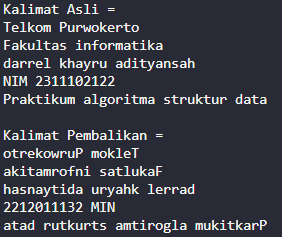
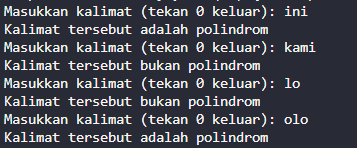

# <h1 align="center">Laporan Praktikum Modul STACK</h1>

<p align="center">DARREL KHAYRU ADITYANSAH</p>
<p align="center">2311102122</p>

## Dasar Teori
tumpukan dari benda, sekumpulan data yang seolah-olah diletakkan di atas data yang lain, koleksi dari objek-objek homogen, atau Suatu urutan elemen yang elemennya dapat diambil dan ditambah hanya pada posisi akhir (top) saja.Stack merupakan bentuk khusus dari suatu  struktur data, dimana node yang ditambahkan ke dalam list dan diambil dari list hanya pada kepalanya, atau dengan prinsip pengolahannya adalah last-in first-out (LIFO). Pada struktur ini hanya ada dua fungsi utama, yaitu push (memasukkan node ke dalam stack), dan pop (mengambil node dari stack).

Dalam suatu tumpukan akan dapat dilakukan operasi penambahan (penyisipan) dan pengambilan (penghapusan) data melalui ujung yang sama, ujung ini merupakan ujung atas tumpukan. Dengan model demikian, maka hanya bagian paling atas saja dari stack(TOP) yang bisa di akses. Salah satu kelebihan stackadalah bahwa struktur data tersebut dapat di implementasikan baik pada array maupun pada linked list. operasi-operasi/fungsi   yang   dapat dilakukan pada stackadalah sebagai berikut :
Push  : digunakan  untuk  menambah  item pada stack pada tumpukan paling atas.
Pop  : digunakan  untuk  mengambil  item pada stack pada tumpukan paling atas
Clear  : digunakan  untuk  mengosongkan stack
IsEmpty  : fungsi  yang  digunakan  untuk mengecek apakah stack sudah kosong.
IsFull   : fungsi   yang   digunakan   untuk mengecek apakah stack sudah penuh

## Guided 

### 1. [Guided 1]
```C++
#include <iostream>
using namespace std;

string arrayBuku[5];
int maksimal = 5, top = 0;

bool isFull() {
    return (top == maksimal);
}

bool isEmpty() {
    return (top == 0);
}

void pushArrayBuku(string data) {
    if (isFull()) {
        cout << "Data telah penuh" << endl;
    } else {
        arrayBuku[top] = data;
        top++;
    }
}

void popArrayBuku() {
    if (isEmpty()) {
        cout << "Tidak ada data yang dihapus" << endl;
    } else {
        arrayBuku[top - 1] = "";
        top--;
    }
}

void peekArrayBuku(int posisi) {
    if (isEmpty()) {
        cout << "Tidak ada data yang bisa dilihat" << endl;
    } else {
        int index = top;
        for (int i = 1; i <= posisi; i++) {
            index--;
        }
        cout << "Posisi ke " << posisi << " adalah " << arrayBuku[index] << endl;
    }
}

int countStack() {
    return top;
}

void changeArrayBuku(int posisi, string data) {
    if (posisi > top) {
        cout << "Posisi melebihi data yang ada" << endl;
    } else {
        int index = top;
        for (int i = 1; i <= posisi; i++) {
            index--;
        }
        arrayBuku[index] = data;
    }
}

void destroyArraybuku() {
    for (int i = top; i >= 0; i--) {
        arrayBuku[i] = "";
    }
    top = 0;
}

void cetakArrayBuku() {
    if (isEmpty()) {
        cout << "Tidak ada data yang dicetak" << endl;
    } else {
        for (int i = top - 1; i >= 0; i--) {
            cout << arrayBuku[i] << endl;
        }
    }
}

int main() {
    pushArrayBuku("Kalkulus");
    pushArrayBuku("Struktur Data");
    pushArrayBuku("Matematika Diskrit");
    pushArrayBuku("Dasar Multimedia");
    pushArrayBuku("Inggris");

    cetakArrayBuku();
    cout << "\n";

    cout << "Apakah data stack penuh? " << isFull() << endl;
    cout << "Apakah data stack kosong? " << isEmpty() << endl;

    peekArrayBuku(2);
    popArrayBuku();
    cout << "Banyaknya data = " << countStack() << endl;

    changeArrayBuku(2, "Bahasa Jerman");
    cetakArrayBuku();
    cout << "\n";

    destroyArraybuku();

    cout << "Jumlah data setelah dihapus: " << top << endl;
    cetakArrayBuku();

    return 0;
}
```
=> penjelasan Program
Program ini memungkinkan pengguna untuk melakukan operasi dasar pada stack seperti push (menambahkan data), pop (menghapus data), peek (melihat data pada posisi tertentu), menghitung jumlah data pada stack, mengubah data pada posisi tertentu, menghapus seluruh data dalam stack, dan mencetak isi stack.


## Unguided 

### 1. [Buatlah Program untuk melakukan pembalikan terhadap kalimat dengan menggunkan stack. Sebanyak 5 ]
```C++
#include <iostream>
#include <stack>
#include <string>

using namespace std;

// Fungsi untuk membalikkan kalimat menggunakan stack
string reverseSentence(string sentence) {
    stack<char> charStack_122;
    string reversedSentence = "";

    // Memasukkan setiap karakter dari kalimat ke dalam stack
    for (char &c : sentence) {
        charStack_122.push(c);
    }

    // Mengambil karakter dari stack untuk membalikkan kalimat
    while (!charStack_122.empty()) {
        reversedSentence += charStack_122.top();
        charStack_122.pop();
    }

    return reversedSentence;
}

int main() {
    // Array berisi lima kalimat
    string kalimat[5] = {
        "Telkom Purwokerto",
        "Fakultas informatika",
        "darrel khayru adityansah",
        "NIM 2311102122",
        "Praktikum algoritma struktur data"
    };

    // Membalikkan dan menampilkan hasil untuk setiap kalimat
    cout << "Kalimat Asli =\n";
    for (int i = 0; i < 5; ++i) {
        cout << kalimat[i] << endl;
    }

    cout << endl;

    cout << "Kalimat Pembalikan =\n";
    for (int i = 0; i < 5; ++i) {
        string reversed = reverseSentence(kalimat[i]);
        cout << reversed << endl;
    }

    return 0;
}
```
### output:


=> Penjelasan Program
 konsep stack untuk membalikkan setiap kalimat yang diberikan. Melalui penggunaan stack, setiap karakter dari kalimat dimasukkan ke dalam stack secara berurutan, dan kemudian diambil kembali dari stack untuk membangun kembali kalimat yang terbalik. Penggunaan stack memungkinkan program untuk mengimplementasikan konsep Last In, First Out (LIFO), di mana karakter terakhir yang dimasukkan ke dalam stack akan menjadi yang pertama kali diambil.

### 2. [buatlah program untuk menentukan apakah kalimat tersebut yang di inputkan dalam program stack adalah polindrom/tidak. Polindrom kalimat yang di baca dari depan dan belakang sama]
```C++
#include <iostream>
#include <stack>
#include <string>

using namespace std;

// Fungsi untuk menentukan apakah sebuah kalimat adalah polindrom
bool isPalindrome(string sentence) {
    stack<char> charStack_122;

    // Memasukkan setiap karakter dari kalimat ke dalam stack
    for (char &c : sentence) {
        charStack_122.push(c);
    }

    // Bandingkan karakter di awal dan akhir
    while (!charStack_122.empty()) {
        char topChar = charStack_122.top();
        charStack_122.pop();
        if (topChar != sentence.front()) {
            return false; // Jika terdapat perbedaan, bukan polindrom
        }
        sentence.erase(0, 1); // Hapus karakter pertama dari kalimat
    }

    return true; // Jika semua karakter cocok, adalah polindrom
}

int main() {
    string kalimat;

    while (true) {
        cout << "Masukkan kalimat (tekan 0 keluar): ";
        getline(cin, kalimat);

        // Keluar dari loop jika pengguna memasukkan 'q'
        if (kalimat == "0") {
            break;
        }

        if (isPalindrome(kalimat)) {
            cout << "Kalimat tersebut adalah polindrom" << endl;
        } else {
            cout << "Kalimat tersebut bukan polindrom" << endl;
        }
    }

    return 0;
}
```
### output:


=> Penjelasan Program
Program menentukan apakah sebuah kalimat yang dimasukkan oleh pengguna merupakan sebuah polindrom atau tidak. Dengan menggunakan konsep stack, setiap karakter dari kalimat dimasukkan ke dalam stack secara berurutan, dan kemudian dibandingkan dengan karakter-karakter dari awal kalimat. Jika terdapat perbedaan antara karakter pertama dan terakhir, maka kalimat tersebut tidaklah merupakan sebuah polindrom. Namun, jika semua karakter cocok, maka kalimat tersebut dianggap sebagai polindrom.

## Kesimpulan
Penggunaan stack dalam kedua program menunjukkan fleksibilitas dan kegunaannya yang besar dalam pemrosesan string. Stack membuktikan dirinya sebagai alat yang efektif untuk pembalikan urutan karakter dalam sebuah kalimat serta pengecekan polindrom. Dengan konsep Last In, First Out (LIFO), stack memungkinkan manipulasi data yang efisien dan konsisten. Selain itu, penggunaan stack dalam kedua program tersebut menunjukkan bahwa dengan pendekatan yang tepat, stack dapat menjadi solusi yang efektif dan elegan untuk berbagai masalah pemrosesan string. 

## Referensi
[1] DIKI MAULANA ALFAJAR. Pengertian Stack
[2] Johnson Sihombing. (2019). PENERAPAN  STACK  DAN  QUEUE  PADA ARRAY DAN  LINKED  LIST DALAM   JAVA
[3] Kenalan dengan Pengertian Stack dalam Pemrograman. (Diakses pada tangga 6 Mei 2024). https://bakrie.ac.id/articles/552-kenalan-dengan-pengertian-stack-dalam-pemrograman.html
