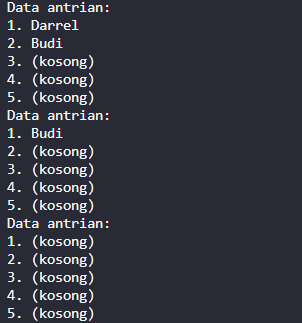
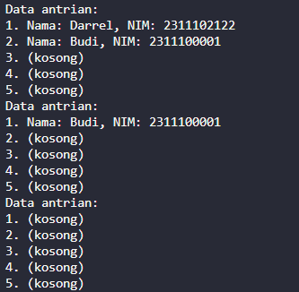

# <h1 align="center">Laporan Praktikum Modul QUEUE</h1>

<p align="center">DARREL KHAYRU ADITYANSAH</p>
<p align="center">2311102122</p>

## Dasar Teori
Queue atau dalam bahasa Indonesia yang berarti antrean adalah struktur data yang menyusun elemen-elemen data dalam urutan linier. Prinsip dasar dari struktur data ini adalah “First In, First Out” (FIFO) yang berarti elemen data yang pertama dimasukkan ke dalam antrean akan menjadi yang pertama pula untuk dikeluarkan. Queue memiliki peran yang penting dalam berbagai aplikasi dan algoritma. Salah satu fungsi utamanya adalah mengatur dan mengelola antrean tugas atau operasi secara efisien. Dalam sistem komputasi, ia digunakan untuk menangani tugas-tugas seperti penjadwalan proses, antrean pesan, dan manajemen sumber daya.

seperti jejeran orang yang sedang menunggu antrean di supermarket di mana orang pertama yang datang adalah yang pertama dilayani (First In, First Out). Pada struktur data ini, urutan pertama (data yang akan dikeluarkan) disebut Front atau Head. Sebaliknya, data pada urutan terakhir (data yang baru saja ditambahkan) disebut Back, Rear, atau Tail. Proses untuk menambahkan data pada antrean disebut dengan Enqueue, sedangkan proses untuk menghapus data dari antrean disebut dengan Dequeue. 

Dengan konsep dan karakteristiknya yang sederhana, Queue menjadi struktur data yang penting dalam pemrograman dan digunakan dalam berbagai aplikasi untuk mengelola urutan data dan mempertahankan prinsip FIFO.

## Guided 

### 1. [Guided 1]
```C++
#include <iostream>
using namespace std;

const int maksimalAntrian_122 = 5;
int front = 0;
int back = 0;
string queueTeller[5];

bool isFull () {
    if (back == maksimalAntrian_122) {
        return true;
    } else {
        return false;
    }
}

// mengecek antrian apakah masih kosong
bool ifEmpty() {
    if (back == 0){ 
        return true;
    } else {
        return false;
    }
}

// menambah antrian
void tambahData (string nama) {
    if (isFull ()) {
        cout << "Antrian sudah penuh." << endl;
    } else {
        if (ifEmpty ()) {
            queueTeller[0] = nama;
            front++;
            back++;
        } else {
            queueTeller[back] = nama;
            back++;
        }
    }
}

// mengurangi antrian
void kurangAntrian () {
    if (ifEmpty ()) {
        cout << "Antrian kosong" << endl;
    } else {
        for (int i = 0; i < back; i++) {
            queueTeller[i] = queueTeller[i+1];
        }
        back++;
    }
}

// menghitung banyak antrian
int count () {
    return back;
}

// menghapus seluruh antrian
void clearQueue () {
    if (ifEmpty ()) {
        cout << "antrian kosong" << endl;
    } else {
        for (int i=0; i < back; i++) {
            queueTeller[i] = "";
        }
        back = 0;
        front = 0;
    }
}

// melihat antrian
void viewQueue () {
    cout << "data antrian : " << endl;
    for (int i = 0; i < maksimalAntrian_122; i++)
    {
        if (queueTeller[i] !="") {
            cout << i+1 << ". " << queueTeller[i] << endl; 
        } else {
            cout << i+1<< ". " << "(kosong)" << endl;
        }
    }
}

// melihat main
int main(){
        tambahData("Alya");
        tambahData("Kiki");
        tambahData("Artika");

        viewQueue();

        //memngurangi antrian
        kurangAntrian();
        viewQueue();

        //menghapus seluruh antrian
        clearQueue();
        viewQueue();

        return 0;
    }
```
=> penjelasan Program
Program tersebut adalah implementasi antrian sederhana menggunakan array dalam bahasa C++. Antrian adalah struktur data linier di mana elemen-elemen baru ditambahkan di ujung belakang dan dihapus dari ujung depan. Dalam program ini, array digunakan untuk menyimpan elemen-elemen antrian, dengan variabel yang menunjukkan posisi ujung depan dan belakang. Fungsi-fungsi digunakan untuk mengelola antrian, seperti menambah, menghapus, dan menampilkan elemen-elemen.


## Unguided 

### 1. [Ubahlah penerapan konsep queue pada bagian guided dari array menjadi linked list]
```C++
#include <iostream>
using namespace std;

struct Node {
    string data_122;
    Node* next_122;
};

Node* front = nullptr;
Node* back = nullptr;
const int maksimalAntrian_122 = 5;
int count = 0;

bool isFull() {
    return count == maksimalAntrian_122;
}

bool isEmpty() {
    return count == 0;
}

void tambahData(string nama) {
    if (isFull()) {
        cout << "Antrian sudah penuh." << endl;
        return;
    }

    Node* newNode_122 = new Node;
    newNode_122->data_122 = nama;
    newNode_122->next_122 = nullptr;

    if (isEmpty()) {
        front = back = newNode_122;
    } else {
        back->next_122 = newNode_122;
        back = newNode_122;
    }
    count++;
}

void kurangAntrian() {
    if (isEmpty()) {
        cout << "Antrian kosong" << endl;
        return;
    }

    Node* temp = front;
    front = front->next_122;
    delete temp;
    count--;
}

void viewQueue() {
    cout << "Data antrian:" << endl;
    Node* current = front;
    int i = 1;
    while (current != nullptr) {
        cout << i << ". " << current->data_122 << endl;
        current = current->next_122;
        i++;
    }
}

void clearQueue() {
    while (front != nullptr) {
        Node* temp = front;
        front = front->next_122;
        delete temp;
    }
    back = nullptr;
    count = 0;
}

int main() {
    tambahData("Budi");
    tambahData("Albert");
    tambahData("Jhonshon");

    viewQueue();

    kurangAntrian();
    viewQueue();

    clearQueue();
    viewQueue();

    return 0;
}
```
### output:


=> Penjelasan Program
Program tersebut adalah implementasi sederhana dari struktur data antrian (queue) menggunakan linked list dalam bahasa pemrograman C++. Struktur data antrian adalah struktur data linier di mana elemen-elemen baru ditambahkan di satu ujung (ujung belakang) dan elemen-elemen dihapus dari ujung lain (ujung depan). beberapa data ditambahkan ke antrian, kemudian isi antrian ditampilkan. Salah satu elemen dihapus dari antrian, dan isi antrian ditampilkan kembali. Terakhir, seluruh isi antrian dihapus dan hasilnya ditampilkan kembali.

### 2. [Dari nomor 1 buatlah konsep antri dengan atribut Nama mahasiswa dan NIM Mahasiswa]
```C++
#include <iostream>
using namespace std;

struct Node {
    string nama;
    string nim;
    Node* next_122;
};

Node* front = nullptr;
Node* back = nullptr;
const int maksimalAntrian_122 = 5;
int count = 0;

bool isFull() {
    return count == maksimalAntrian_122;
}

bool isEmpty() {
    return count == 0;
}

void tambahData(string nama, string nim) {
    if (isFull()) {
        cout << "Antrian sudah penuh." << endl;
        return;
    }

    Node* newNode_122 = new Node;
    newNode_122->nama = nama;
    newNode_122->nim = nim;
    newNode_122->next_122 = nullptr;

    if (isEmpty()) {
        front = back = newNode_122;
    } else {
        back->next_122 = newNode_122;
        back = newNode_122;
    }
    count++;
}

void kurangAntrian() {
    if (isEmpty()) {
        cout << "Antrian kosong" << endl;
        return;
    }

    Node* temp = front;
    front = front->next_122;
    delete temp;
    count--;
}

void viewQueue() {
    cout << "Data antrian:" << endl;
    Node* current = front;
    int i = 1;
    while (current != nullptr) {
        cout << i << ". Nama: " << current->nama << ", NIM: " << current->nim << endl;
        current = current->next_122;
        i++;
    }
}

void clearQueue() {
    while (front != nullptr) {
        Node* temp = front;
        front = front->next_122;
        delete temp;
    }
    back = nullptr;
    count = 0;
}

int main() {
    tambahData("Darrel", "2311102122");
    tambahData("Budi", "2311100001");
    tambahData("Albert", "2311100010");
    tambahData("Jhonshon", "2311100011");
    tambahData("Dapa", "2311100111");
    tambahData("Gendon", "2311100101");
    tambahData("Nohar", "2311100110");

    viewQueue();

    kurangAntrian();
    viewQueue();

    clearQueue();
    viewQueue();

    return 0;
}
```
### output:


=> Penjelasan Program
 implementasi sederhana dari struktur data antrian menggunakan linked list dalam bahasa pemrograman C++. Dalam program tersebut, antrian digunakan untuk mengatur data mahasiswa yang terdiri dari nama dan NIM. Fungsi-fungsi yang tersedia memungkinkan operasi dasar pada antrian, seperti menambah, menghapus, menampilkan isi, dan mengosongkan antrian. beberapa data mahasiswa ditambahkan ke antrian, yang kemudian ditampilkan. Setelah itu, satu elemen mahasiswa dihapus dari antrian dan isi antrian diperbarui. Terakhir, seluruh isi antrian dihapus dan hasilnya ditampilkan kembali.

## Kesimpulan
antrian (queue) menggunakan C++, baik menggunakan array statis maupun linked list, kita memiliki akses untuk melakukan operasi dasar seperti menambah, menghapus, dan melihat isi antrian. Konsep dasar antrian, yang mengikuti prinsip "First In, First Out" (FIFO), memastikan bahwa elemen yang pertama dimasukkan ke dalam antrian akan menjadi yang pertama dikeluarkan, menjadikannya sangat berguna untuk penjadwalan tugas atau operasi. Dengan prinsip ini, antrian membantu dalam mengatur proses secara efisien, memastikan bahwa setiap elemen diproses sesuai urutannya.

## Referensi
[1] Struktur Data Queue: Pengertian, Fungsi, dan Jenisnya. (Diakses pada tangga 14 Mei 2024). https://www.dicoding.com/blog/struktur-data-queue-pengertian-fungsi-dan-jenisnya/
[2] Ricky Pratama. Queue: Pengenalan, Implementasi, Operasi Dasar, dan Aplikasi. (diakses pada tanggal 14 mei 2024). https://medium.com/@furatamarizuki/queue-pengenalan-implementasi-operasi-dasar-dan-aplikasi-c5eed7e871a3